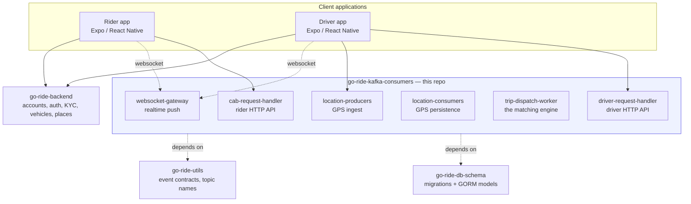
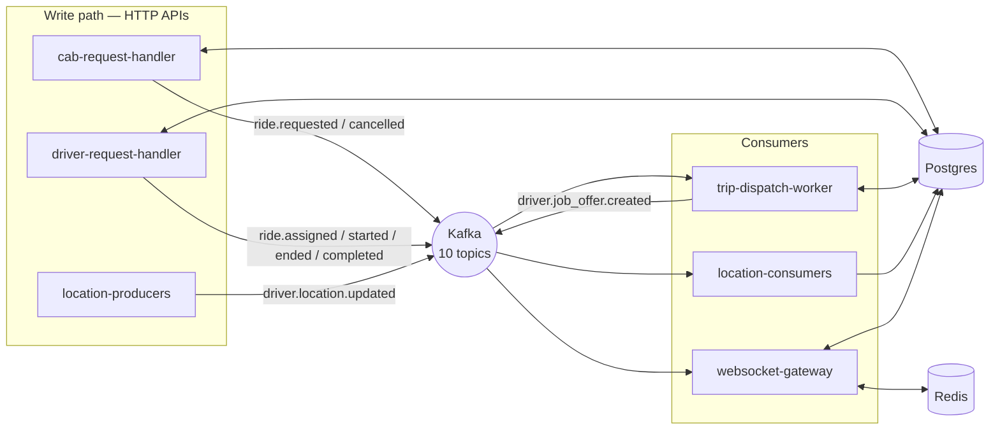
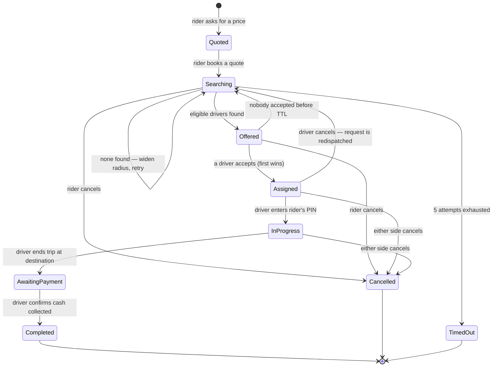
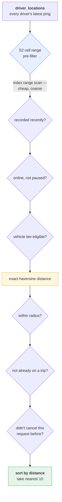
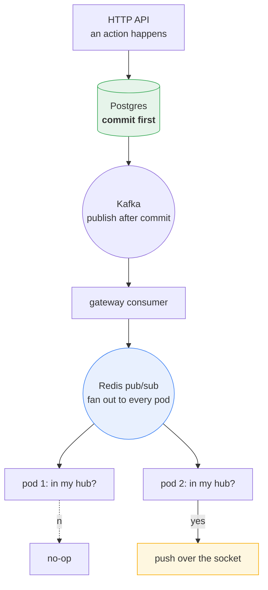

# Go Ride — Realtime Core

**The trip engine of Go Ride**, a ride-hailing platform. This repo is a monorepo of six independently deployable, Kafka-driven Go services that take a rider from "I want a ride" to "a driver is coming" and through to completion — fare quoting, booking, geospatial driver matching, first-wins job acceptance, cancellation/redispatch, and realtime WebSocket delivery to both apps.

Everything that is *not* a live trip — signup/login, profiles, vehicles, KYC — lives in the sibling repo **[go-ride-backend](https://github.com/shawon-kanji/go-ride-backend)**.

<p align="center">
  
  
  
  
  
  
  
</p>

> The docs in [`docs/`](docs/) go considerably deeper than this README — they're written as a set of engineering essays on *why* each piece works the way it does, not just *what* it does. Start with [`docs/architecture-overview.md`](docs/architecture-overview.md), then [`docs/engineering-challenges.md`](docs/engineering-challenges.md) for the hardest problems and how they were actually solved.

---

## The core constraint that shapes everything

**The rider app and the driver app never talk to each other. Not once, at any point in a trip.** Every piece of information that travels between them is first written to Postgres, then published as a Kafka event, then pushed out over a WebSocket. That indirection costs latency and buys three things the system depends on: **durability** (an offer created while a driver's phone is in a tunnel still exists as a database row), **auditability** (every state change leaves a `trip_history` row), and **scalability** (no service holds authoritative state in memory, so any of them can run as many replicas as they need).

## System map





## The six services

| Service | Role |
|---|---|
| **`cab-request-handler`** | Rider's API. Multi-tier fare quoting (real driving route via a directions client, haversine fallback), booking against a locked quote, cancellation, current-trip polling, trip history, driver ratings. |
| **`driver-request-handler`** | Driver's API — the mirror image. First-wins job acceptance under real concurrency, start/end/collect-payment, cancellation, earnings/online-time/stats. |
| **`location-producers`** | Deliberately thin GPS ingest endpoint — the highest-volume entry point in the system. No DB, no logic, just publish. |
| **`location-consumers`** | Persists the location stream to `driver_locations`, indexed for the geospatial dispatch query. |
| **`trip-dispatch-worker`** | The matching engine, and the most algorithmically interesting service — S2-indexed nearest-driver search, eligibility filtering, ranked offer creation, radius/backoff retry, redispatch. |
| **`websocket-gateway`** | Holds every live client connection, delivers events — a *delivery* layer only, never a decision-maker. |

## The full trip lifecycle



## How dispatch finds a driver, without PostGIS

The schema has no PostGIS extension and no spatial index — just lat/lng doubles. Nearest-driver search instead uses a **numeric range scan over S2 cell IDs**: every point on Earth maps to a leaf-level S2 cell, and any coarser cell's descendants occupy a *contiguous* range of leaf IDs — so "is this point inside this region?" becomes a plain, index-backed `BETWEEN`.



Cheap, index-backed filters run first; expensive trigonometry runs only on what survives them. Full derivation and the bug that almost shipped a broken version of this: [`docs/dispatch-and-matching.md`](docs/dispatch-and-matching.md) and [`docs/engineering-challenges.md`](docs/engineering-challenges.md) §1.

## Realtime delivery — pushing to a socket you can't see

A driver's HTTP request and a rider's open WebSocket almost never land on the same pod. Rather than sticky sessions or a connection registry, every gateway pod gets every event over Redis pub/sub and checks its own in-memory hub — a miss just costs a map lookup.



The one pipeline that *doesn't* use this pattern is location: a fleet-wide GPS firehose is filtered **before** fan-out (a Redis lookup of "is this driver on an active trip?"), because filtering after fan-out would mean every pod processing every idle driver's every ping. See [`docs/driver-rider-realtime-communication.md`](docs/driver-rider-realtime-communication.md).

## Docs index

| Document | Question it answers |
|---|---|
| [`docs/architecture-overview.md`](docs/architecture-overview.md) | What is this platform, and why is it split this way? |
| [`docs/cab-request-flow.md`](docs/cab-request-flow.md) | How does a rider get from "I want a ride" to "a driver is coming"? |
| [`docs/dispatch-and-matching.md`](docs/dispatch-and-matching.md) | How does the system decide *which* drivers get offered the job? |
| [`docs/driver-rider-realtime-communication.md`](docs/driver-rider-realtime-communication.md) | How do the two apps see each other's actions in real time? |
| [`docs/cancellation-and-redispatch.md`](docs/cancellation-and-redispatch.md) | What happens when either side backs out — and the concurrency bugs that only appeared once redispatch was exercised end-to-end? |
| [`docs/engineering-challenges.md`](docs/engineering-challenges.md) | The ten genuinely hard problems in this platform, and how each was solved. |
| [`docs/scaling-and-cost.md`](docs/scaling-and-cost.md) | A staged, cost-justified plan for scaling from 1k to 200k online drivers. |

## Design principles the code actually follows

- **Publish after commit, never before** — a client can never be told about a state the database hasn't durably recorded.
- **The database decides races, not the application** — `SELECT ... FOR UPDATE` settles first-wins acceptance; no application locks, no Redis locks.
- **Identity comes from the JWT, never the request body.**
- **Every client has a polling fallback** — a missed WebSocket push costs immediacy, never correctness.
- **Schema ships before the code that uses it** — a migration is tagged in `go-ride-db-schema` first; services bump the dependency second, as its own commit.

## Tech stack

Go 1.25 · Kafka (`kafka-go`) · PostgreSQL (GORM) · Redis (pub/sub + active-trip cache) · Gin (HTTP) · [S2 geometry](https://github.com/golang/geo) for spatial indexing · Gorilla WebSocket · Docker + Helm per service.

## Getting started

```bash
# Local infra (Kafka, Redis, Postgres, AIStor) — delegates to the sibling
# go-ride-infra repo's consolidated compose file
make up
make topic-create-all

# Shared schema — delegates to the sibling go-ride-db-schema repo
make migrate-up

make run-location-producers
make run-location-consumers
make run-cab-request-handler
make run-dispatch-api
make run-dispatch-consumer
```

```bash
make test-location
make test-cab
make test-dispatch
```

Requires the sibling repos checked out alongside this one: `go-ride-infra`, `go-ride-db-schema`, `go-ride-utils`, and `go-ride-backend`.

## Repo layout

```
cmd/driver-location-worker/   legacy standalone binary (not part of go.work)
services/
  cab-request-handler/         rider HTTP API — prefix /api/v1/cab
  driver-request-handler/      driver HTTP API — prefix /api/v1/driver-trips
  location-producers/          GPS ingest HTTP API
  location-consumers/          GPS persistence worker
  trip-dispatch-worker/        the matching engine
  websocket-gateway/            /api/v1/ws/{driver,rider}
```

Each service is an independently versioned Go module with its own `go.mod`, `Dockerfile`, and Helm chart, wired together for local development via the root `go.work`.

