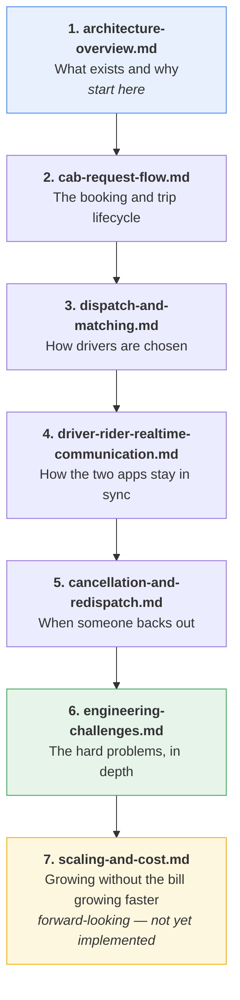

# go-ride Documentation

Technical documentation for the go-ride ride-hailing platform. Written to be
read in order by someone new to the system, but each document also stands
alone.

## Reading order

| Document | Answers |
|---|---|
| [architecture-overview.md](architecture-overview.md) | What is this system, which services exist, what are the design principles? |
| [cab-request-flow.md](cab-request-flow.md) | How does a rider go from "I want a ride" to a completed trip? |
| [dispatch-and-matching.md](dispatch-and-matching.md) | How does the system decide which drivers get offered a job? |
| [driver-rider-realtime-communication.md](driver-rider-realtime-communication.md) | How does a driver's action appear on the rider's screen a moment later? |
| [cancellation-and-redispatch.md](cancellation-and-redispatch.md) | What happens when either party cancels, and how is a replacement driver found? |
| [engineering-challenges.md](engineering-challenges.md) | What was genuinely difficult here, and what did each solution cost? |
| [scaling-and-cost.md](scaling-and-cost.md) | How does this grow to 200k drivers without the AWS bill outrunning revenue? **Planning document — describes future work, not current state.** |

## If you only have ten minutes

Read `architecture-overview.md` sections 1, 3 and 6, then the two end-to-end
sequence diagrams in `cab-request-flow.md` §10 and
`driver-rider-realtime-communication.md` §2.

## If you are evaluating the engineering

`engineering-challenges.md` is the document with the most substance — it is
organised as problem → reasoning → cost, and includes an honest account of
one unsolved gap. `cancellation-and-redispatch.md` §6 is the best worked
example of finding bugs that only exist at the intersection of a new feature
and old, unstated assumptions.

## Related documentation in sibling repositories

| Repository | Documentation |
|---|---|
| `go-ride-infra` | `docs/architecture.md` — cloud topology, networking, secrets; `docs/runbook-local.md` and `docs/runbook-cluster.md` — operations |
| `go-ride-backend` | `CONSTITUTION.md` — service design principles; `doc/` — monitoring and KYC plans |
| `go-ride-db-schema` | `README.md` — migration and release workflow |

## Conventions used in these documents

- **Diagrams are Mermaid** and render natively in GitHub and most Markdown
  viewers.
- **Every document ends with a "Known limitations" section.** These are
  deliberate and honest — the absence of a feature is documented as clearly as
  its presence.
- **Code paths are named where useful**, but these documents describe
  behaviour and reasoning, not line-by-line implementation. The code is the
  authority on *what*; these are the authority on *why*.
