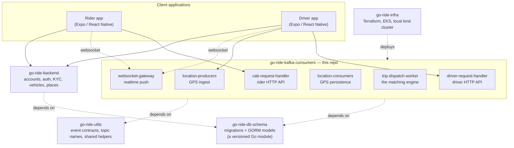
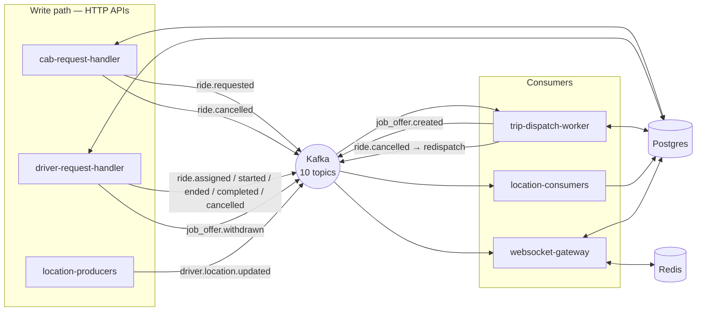
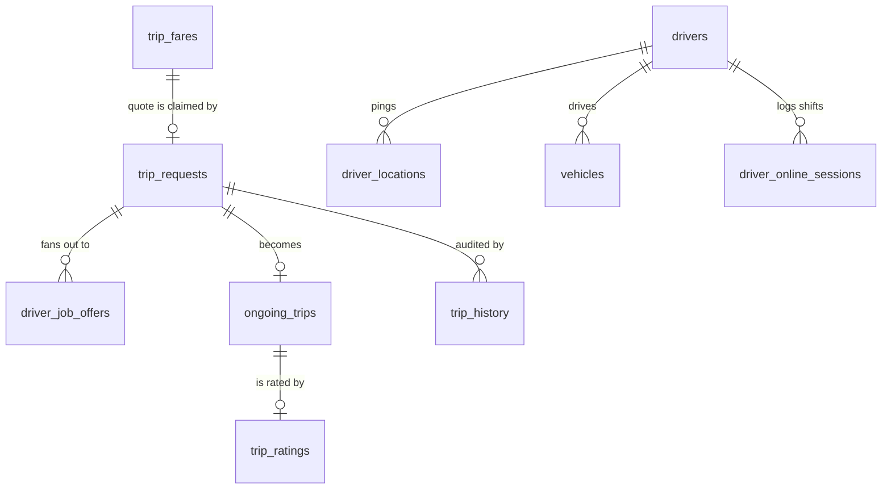
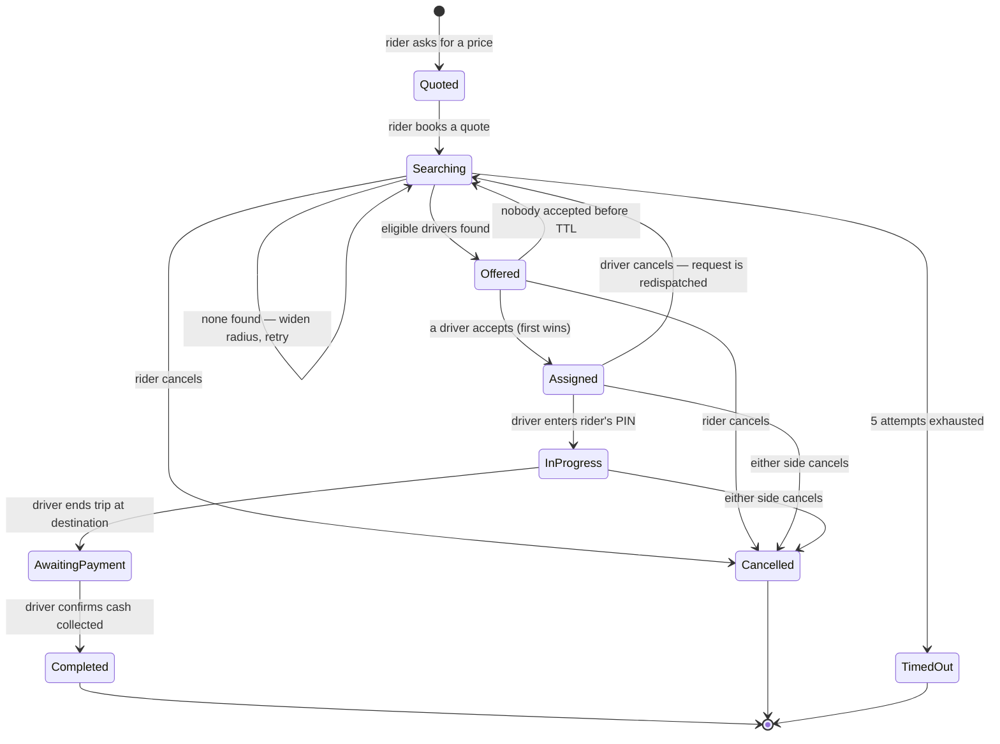

# Architecture Overview

**Read this first.** It explains what the go-ride platform is, which pieces
exist, and why they are split the way they are. The other documents in this
folder go deep on one flow each:

| Document | Question it answers |
|---|---|
| `cab-request-flow.md` | How does a rider get from "I want a ride" to "a driver is coming"? |
| `dispatch-and-matching.md` | How does the system decide *which* drivers get offered the job? |
| `driver-rider-realtime-communication.md` | How do the two apps see each other's actions in real time? |
| `cancellation-and-redispatch.md` | What happens when either side backs out? |
| `engineering-challenges.md` | What was genuinely hard here, and how was it solved? |

---

## 1. What the system does

go-ride is a ride-hailing platform: riders request cabs, the system finds
nearby drivers, one driver wins the job, and the trip runs to completion.

The defining constraint — and the reason the architecture looks the way it
does — is that **the rider app and the driver app never talk to each other.**
Not once, at any point in a trip. Every piece of information that travels
between them is first written to a database, then published as an event, then
pushed out over a socket. That indirection costs latency, and buys three
things the system depends on:

1. **Durability.** If a driver's phone is in a tunnel when a job offer is
   created, the offer still exists — it is a row in Postgres. They see it
   when they reconnect.
2. **Auditability.** Every state change leaves a `trip_history` row. You can
   reconstruct exactly what happened on any trip, after the fact.
3. **Scalability.** No server holds authoritative state in memory, so any
   service can run as many replicas as it needs.

## 2. The repositories

The platform is spread across six repositories that are checked out as
siblings. This repo (`go-ride-kafka-consumers`) holds the realtime core.

| Repository | Owns |
|---|---|
| **go-ride-kafka-consumers** | The six realtime services listed above — booking, dispatch, driver actions, location, WebSocket delivery. |
| **go-ride-backend** | Everything that is *not* a live trip: signup/login and JWT issuance, rider and driver profiles, driver KYC document upload, vehicle registration, the driver online/pause toggle, and places autocomplete. Routes live under `/api/v1/auth`, `/api/v1/driver`, `/api/v1/places`. |
| **go-ride-db-schema** | The single source of truth for the database. Numbered SQL migrations plus matching GORM models, published as a tagged Go module that every other service imports. Nobody defines their own table. |
| **go-ride-utils** | Shared code that would otherwise drift: Kafka event structs, topic-name constants, HTTP header names, AWS Secrets Manager loading. |
| **go-ride-infra** | Terraform for VPC/EKS/RDS/MSK/ElastiCache/ECR/IAM, plus the local `kind` + docker-compose tooling. |

## 3. The six services in this repo

**`cab-request-handler`** — the rider's API. Prices a trip, books it, reports
current status, lists past trips, accepts cancellations and driver ratings.

**`driver-request-handler`** — the driver's API, and the mirror image of the
one above. Accepting a job offer, starting/ending a trip, collecting payment,
cancelling, plus the driver's earnings, online-time and stats screens.

**`location-producers`** — a deliberately thin HTTP endpoint that accepts a
GPS ping from a driver's phone and publishes it to Kafka. No database, no
logic. Kept thin because it is the highest-volume entry point in the system.

**`location-consumers`** — reads that stream and writes it to
`driver_locations`. Also deliberately thin.

**`trip-dispatch-worker`** — the matching engine, and the most algorithmically
interesting service. Given a ride request, it finds eligible nearby drivers
and creates job offers for them. It is the *only* service that decides who
gets offered a job.

**`websocket-gateway`** — holds every live client connection and pushes
events out to them. It is a *delivery* layer only: it never decides anything
about a trip, it only tells clients what already happened.

### Why the write path and the push path are separate services

It would be simpler to have `driver-request-handler` push directly to a
rider's socket when a driver accepts. It does not, because **the accepting
driver's HTTP request lands on a different machine than the rider's open
WebSocket.** With multiple replicas of each service, the service that
processes an action essentially never holds the connection of the person who
needs to hear about it. Kafka plus Redis solves that routing problem
(explained fully in `driver-rider-realtime-communication.md`).

## 4. The data stores, and what each is for

| Store | Role | What breaks without it |
|---|---|---|
| **Postgres** | The source of truth. Every trip fact lives here. | Everything. |
| **Kafka** | The nervous system. Services communicate by publishing events, never by calling each other. | Services stop hearing about each other's actions; HTTP APIs still work. |
| **Redis** | Two jobs: pub/sub fan-out between gateway replicas, and a small `driver → active trip` lookup used to filter the location firehose. | Realtime pushes stop; clients fall back to polling. |

Note what Redis is *not* used for: it holds no trip state that matters. Its
entire contents can be lost and the system still knows every trip's true
state — clients just lose live updates until they poll.

## 5. The core tables

The lifecycle moves left to right across three tables, and **which table is
authoritative changes as the trip progresses**:

1. **`trip_fares`** — a price quote. Created when a rider asks what a trip
   costs. Exists before any trip does.
2. **`trip_requests`** — a search in progress. Authoritative from booking
   until a driver accepts.
3. **`ongoing_trips`** — a real trip with a real driver. Authoritative from
   acceptance onward.

`driver_job_offers` is the fan-out table in between: one row per driver who
was offered the job. `trip_history` is an append-only audit log spanning all
of it.

## 6. Design principles the code actually follows

These are not aspirations — each one is enforced in the code, and each is
there because the alternative caused a concrete problem.

**Publish after commit, never before.** Every service commits its database
transaction *first*, then publishes to Kafka. This makes it impossible for a
client to be told about a state that the database has not yet durably
recorded. A dropped event costs a client a live update; a premature event
would cost correctness.

**The database decides races, not the application.** Two drivers tapping
"accept" at the same instant is resolved by `SELECT ... FOR UPDATE` on the
trip request row, not by a lock in application memory, not by Redis, and not
by timestamps. Whoever the database serializes first wins; the loser gets a
`409`.

**Identity comes from the token, never from the request body.** A rider's ID
is read from their JWT claims. There is no endpoint where a client can name
which rider or driver it is acting as.

**Every client has a polling fallback.** WebSocket delivery is best-effort.
Both apps can call a `/current-trip` endpoint that reads the same Postgres
rows the pushes are derived from. A missed push costs immediacy, never
correctness.

**Schema changes ship before the code that uses them.** A migration is
written and released as a new tag of `go-ride-db-schema` in its own commit,
and only then do services bump the dependency. This keeps a deploy ordering
that always works: database first, code second.

## 7. The full trip lifecycle, at a glance

Every subsequent document zooms into one part of this picture.

## 8. Where to go next

- To understand **booking**, read `cab-request-flow.md`.
- To understand **matching**, read `dispatch-and-matching.md`.
- To understand **realtime**, read `driver-rider-realtime-communication.md`.
- For the **hard parts and their trade-offs**, read
  `engineering-challenges.md` — that is the document with the most
  engineering substance in it.
