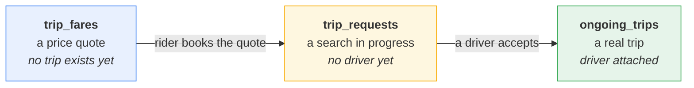
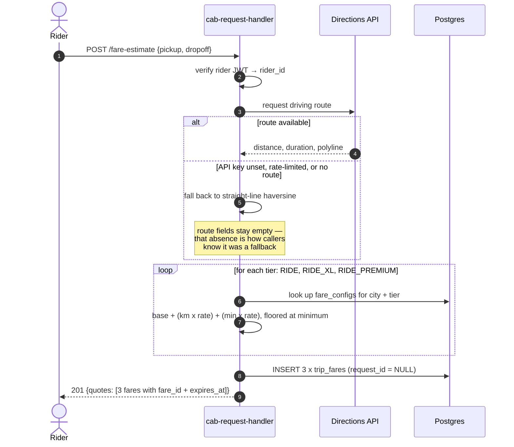
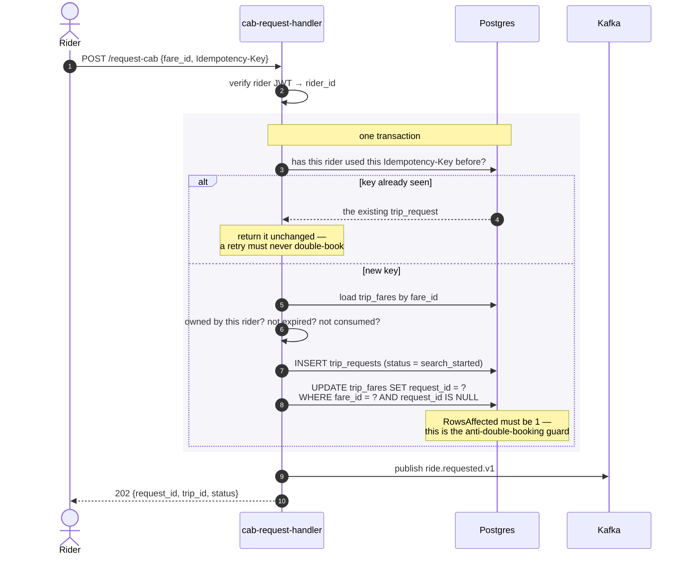
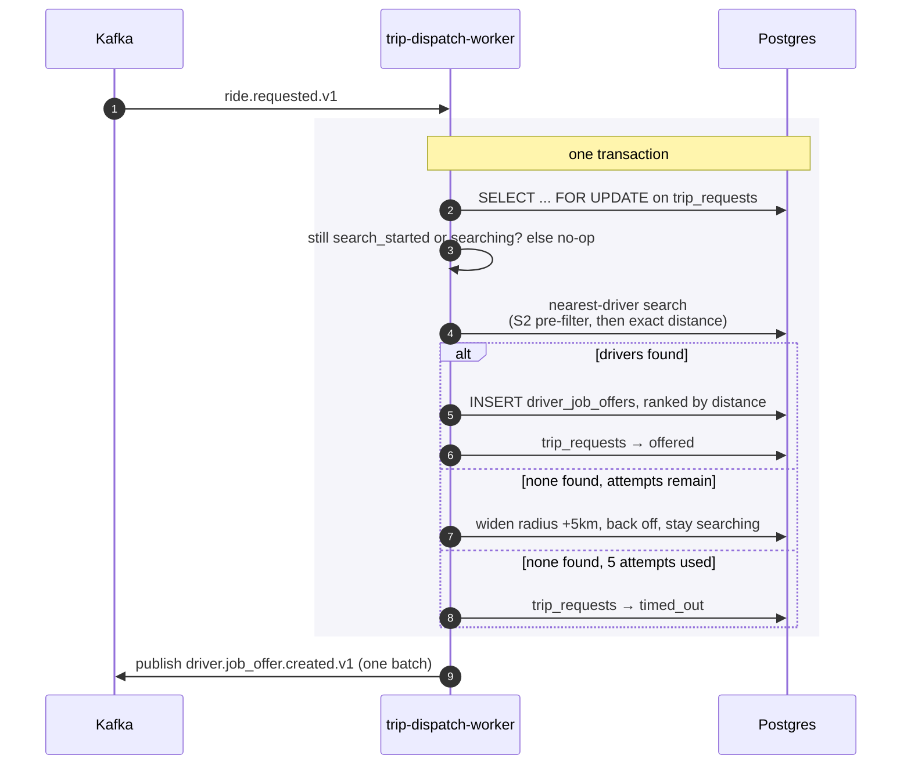
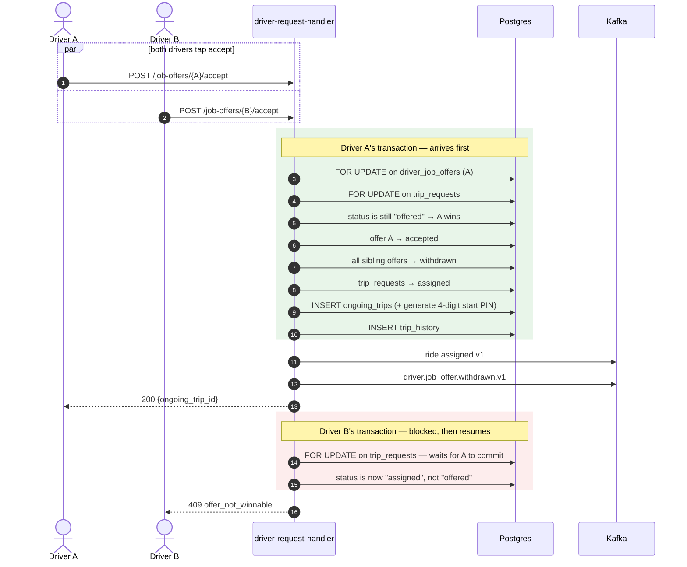
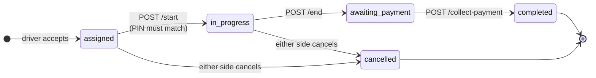
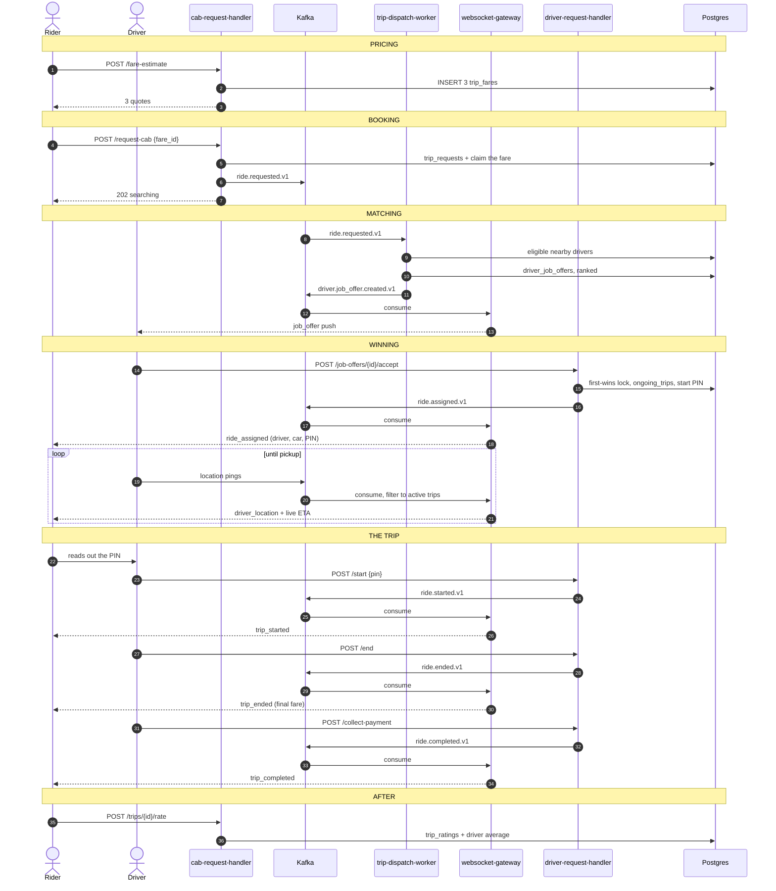

# The Cab Request Flow

How a ride goes from a rider tapping "where to?" through to cash in the
driver's hand. This is the **booking and trip lifecycle**; the matching
algorithm that picks drivers has its own document
(`dispatch-and-matching.md`), as does the realtime push layer
(`driver-rider-realtime-communication.md`).

Read `architecture-overview.md` first if you have not.

---

## 1. The shape of the problem

A ride booking looks like one action to a rider, but it is really five
separate problems, each with its own failure mode:

1. **Pricing** — the rider must see a price *before* committing, and that
   price must not change underneath them.
2. **Booking** — turning a price into a committed search, exactly once, even
   if the phone retries the request.
3. **Matching** — finding drivers who can actually take the job.
4. **Winning** — exactly one driver gets the job, even if ten tap "accept"
   simultaneously.
5. **Running the trip** — start, end, payment, with the right person in the
   right car.

The flow below is structured around those five.

## 2. The three tables, and which one is in charge

The single most important thing to understand about this flow is that
**authority moves between tables as the trip progresses**:



If you want to know a trip's true status, *which table you ask depends on how
far along it is.* Before acceptance, `trip_requests.status` is the truth.
After acceptance, `ongoing_trips.status` is the truth, and `trip_requests` is
kept in sync only so the rider's "do I have anything active?" query has one
place to look.

## 3. Stage one — pricing

`POST /api/v1/cab/fare-estimate` *(rider JWT required)*

The rider sends a pickup and a dropoff. They get back **three prices**, one
per service tier, and no trip is created.



Three design decisions worth noting:

**Pricing uses a real driving route when it can get one.** Straight-line
distance systematically under-prices any city with a river, a one-way system,
or a motorway. The system asks a directions API for the real route, and falls
back to haversine only if that call fails — a maps outage should degrade
pricing accuracy, never block booking.

**Prices come from the database, not from config.** `fare_configs` holds
per-city, per-tier rates with an effective-from/to window and a priority
column, so pricing can change without a deploy. A legacy environment-variable
path still exists as a fallback for the base tier so a freshly-seeded database
can still quote something.

**All three tiers are priced at once.** The route is computed once — it does
not change based on which car the rider picks — and then costed three times.
Each tier gets its own `trip_fares` row and its own `fare_id`.

A quote is **locked**: the row stores the exact numbers, and an `expires_at`
timestamp. Nothing recalculates it later.

## 4. Stage two — booking

`POST /api/v1/cab/request-cab` *(rider JWT required)*

The rider does *not* re-send the pickup and dropoff. They send a `fare_id` —
the quote they picked. This is the key design choice of the whole flow:

> **Booking consumes a quote. It does not create one.**

Because the quote already contains the pickup, the dropoff, the price and the
search radius, the booking call carries no pricing inputs at all. A client
cannot influence the price at booking time, because there is nothing about
the price left to send.



### The four ways booking can be rejected

| Condition | Response | Why it is a hard error, not a silent fix |
|---|---|---|
| `fare_id` does not exist | `404 fare_not_found` | — |
| `fare_id` belongs to another rider | `404 fare_not_found` | Deliberately indistinguishable from "does not exist", so the API cannot be used to probe whether a quote exists. |
| Quote has expired | `409 fare_expired` | The system will **not** silently reprice. The rider agreed to a number; if it is stale they must be shown a new one and agree again. |
| Quote already booked | `409 fare_already_used` | Covers both "booked earlier" and "lost a concurrent race for the same quote". |

### How double-booking is actually prevented

The guard is a single conditional UPDATE, inside the same transaction as the
insert:

```sql
UPDATE trip_fares SET request_id = ? WHERE fare_id = ? AND request_id IS NULL
```

If two requests race for the same `fare_id`, both may pass the earlier
validation reads, but only one `UPDATE` can report `RowsAffected == 1`. The
other sees `0` and its whole transaction rolls back. There is no application
lock, no Redis key, and no retry loop — the database's own row-level
serialization settles it.

This is why `trip_fares.request_id` is nullable-but-unique rather than the
more obvious `trip_requests.fare_id` being the only link. `NULL` means
"unconsumed and bookable"; a value means "claimed". Postgres permits many
`NULL`s in a unique column, so the constraint costs nothing when quotes go
unused — which is most of the time, since a rider is shown three and books at
most one.

## 5. Stage three — matching

Publishing `ride.requested.v1` hands the request to `trip-dispatch-worker`.
The full algorithm is in `dispatch-and-matching.md`; the summary is:



Two properties make this safe to run repeatedly:

**It is idempotent.** The row lock plus the status guard mean that calling
`AttemptDispatch` on a request that has already moved past dispatch is a
logged no-op. A redelivered Kafka message causes no duplicate offers.

**It retries itself.** When no driver is found, the request stays in
`searching` with a `next_dispatch_at` timestamp. A separate sweep loop polls
for due requests every few seconds and tries again — radius grows 20 → 25 →
30 km, backoff grows 2 → 4 → 8 → 16 seconds, and after five total attempts
the request times out.

## 6. Stage four — winning the job

`POST /api/v1/driver-trips/job-offers/{job_offer_id}/accept` *(driver JWT)*

Several drivers are holding the same live offer. Exactly one must win.



### Why the losers are "withdrawn" and not "expired"

These are two genuinely different events for the driver, and the app renders
them differently:

- **expired** — the offer's TTL simply ran out and nobody took it. The
  driver's own countdown already showed this.
- **withdrawn** — someone else got it, or the rider cancelled. The card
  should vanish immediately with an explanation.

Losing offers are locked and captured (rather than blind-bulk-updated) so the
exact `(job_offer_id, driver_id)` pairs are available to publish on
`driver.job_offer.withdrawn.v1` after commit — which is what lets the gateway
proactively clear those cards.

### The start PIN

Acceptance generates a random four-digit PIN, stored on the trip and sent to
the rider. The driver must type it in to start the trip. This is the one
place in the flow that verifies the driver physically found the *right*
rider, rather than trusting a tap. It is regenerated on every assignment, so
a PIN never carries over to a replacement driver after a cancellation.

## 7. Stage five — running the trip

Three endpoints, all on `driver-request-handler`, all following the same
shape: row-lock, validate ownership and status, update, write history,
commit, publish.



| Endpoint | Transition | What it does that is not obvious |
|---|---|---|
| `POST /ongoing-trips/{id}/start` | `assigned → in_progress` | Requires the rider's PIN. Wrong PIN is a `409`, not a warning. |
| `POST /ongoing-trips/{id}/end` | `in_progress → awaiting_payment` | Copies the **locked quote** into `final_fare`. There is no recalculation from actual distance — the rider pays what they were quoted. |
| `POST /ongoing-trips/{id}/collect-payment` | `awaiting_payment → completed` | Cash-only, driver-confirmed. No payment gateway exists. |

The `awaiting_payment` state exists because cash settlement is not
instantaneous: the trip is physically over, but the driver is still standing
with the rider. During it the driver is still excluded from new dispatch, and
the rider can still see the amount due.

## 8. After the trip — rating

`POST /api/v1/cab/trips/{ongoing_trip_id}/rate` *(rider JWT)*

Riders rate drivers, 1–5, once per trip, only on a completed trip. A second
attempt is a `409`, never a silent overwrite.

The write locks two rows: the trip (so two concurrent rating attempts on the
same trip serialize) and the driver's row (so ratings arriving from two
*different* trips cannot lose an update while recomputing the running
average). The average is maintained incrementally on `drivers` rather than
recomputed from `trip_ratings` on every read.

## 9. The rider's view throughout

Two read endpoints back the rider app, and both exist as **fallbacks for
missed WebSocket pushes**:

| Endpoint | Returns |
|---|---|
| `GET /api/v1/cab/current-trip` | Whichever of the active request / ongoing trip exists, with the fare attached. Covers every active status including `awaiting_payment`. |
| `GET /api/v1/cab/trips` | Terminal trips, newest first, keyset-paginated on `(assigned_at, id)` so a page boundary cannot shift under concurrent inserts. |

The driver side has exact mirrors: `GET /api/v1/driver-trips/current-trip` (crash
recovery — "which trip am I on?"), `/trips`, plus `/earnings`, `/online-time`
and `/stats`.

## 10. Complete flow, end to end



## 11. API summary

**Rider — `cab-request-handler`, prefix `/api/v1/cab`**

| Method | Path | Purpose |
|---|---|---|
| POST | `/fare-estimate` | Price a trip across all three tiers |
| POST | `/request-cab` | Book a quote, start the search |
| POST | `/request-cab/{request_id}/cancel` | Cancel at any stage |
| GET | `/current-trip` | Active request and/or ongoing trip |
| GET | `/trips` | Paginated trip history |
| POST | `/trips/{ongoing_trip_id}/rate` | Rate the driver |

**Driver — `driver-request-handler`, prefix `/api/v1/driver-trips`**

| Method | Path | Purpose |
|---|---|---|
| POST | `/job-offers/{job_offer_id}/accept` | Win a job |
| POST | `/ongoing-trips/{id}/start` | Start, with the rider's PIN |
| POST | `/ongoing-trips/{id}/end` | Arrive, fix the final fare |
| POST | `/ongoing-trips/{id}/collect-payment` | Confirm cash received |
| POST | `/ongoing-trips/{id}/cancel` | Cancel an accepted trip |
| GET | `/current-trip` | Crash recovery |
| GET | `/trips` `/earnings` `/online-time` `/stats` | Driver dashboard |

All endpoints require a Bearer JWT, and the acting user's ID always comes
from the token's claims — never from the request body.

## 12. Known limitations

Honest accounting of what this flow does not do:

- **Cash only.** No payment gateway, no card handling. `collect-payment` is
  the driver asserting they were paid.
- **The quote is the final price.** No recalculation for a longer-than-
  expected route, traffic, or waiting time.
- **No surge.** `fare_surcharges` exists as a table; nothing writes to it.
  `surge_multiplier` is always 1.
- **No driver-rates-rider.** Ratings are one-directional.
- **No reject button.** A driver who does not want a job lets it expire. The
  wire protocol parses a `rejected` acknowledgement, but it has no effect on
  dispatch.
- **`driver_arriving` is defined but unused.** The state machine allows it;
  no endpoint transitions into it. Acceptance goes straight to `assigned` and
  the PIN check goes straight to `in_progress`.
