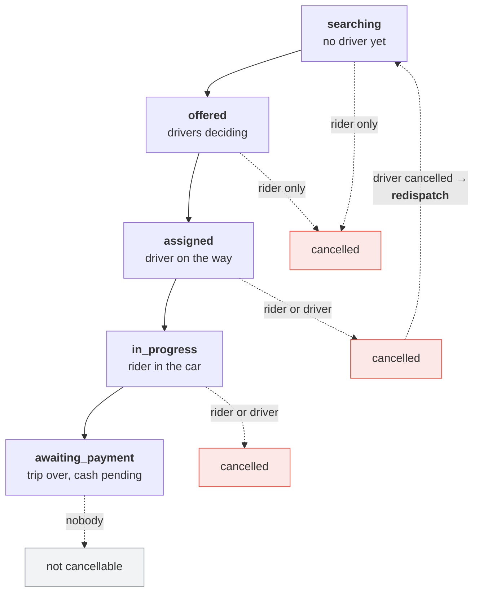
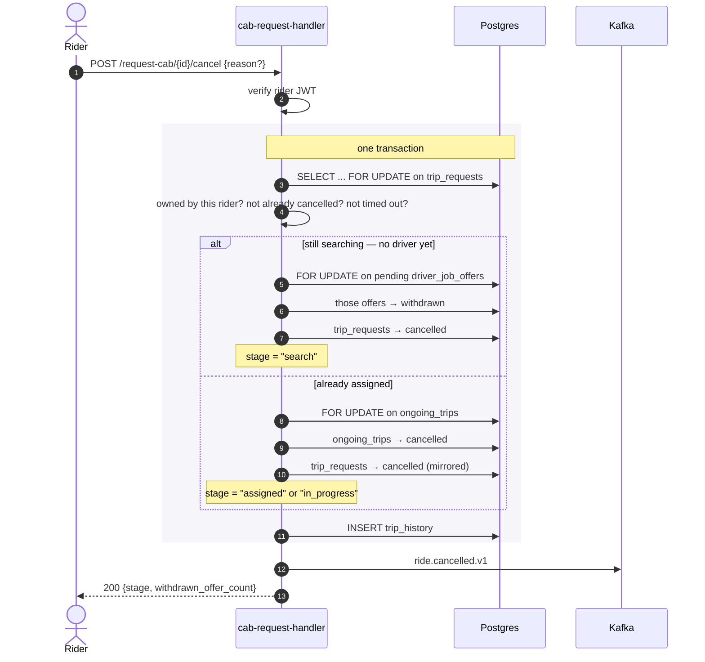
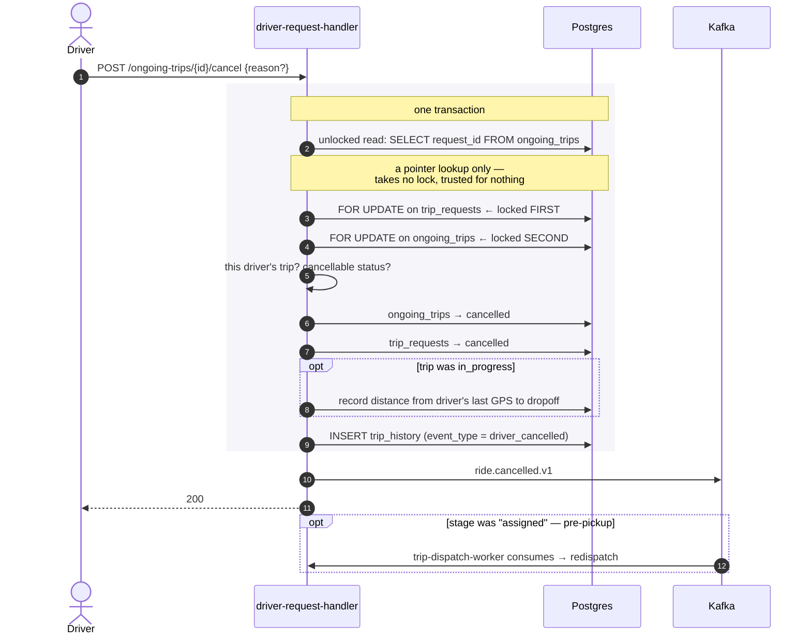
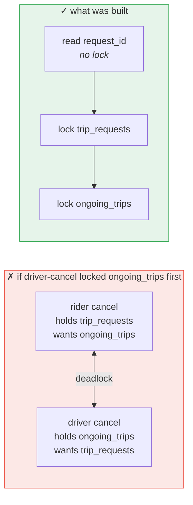
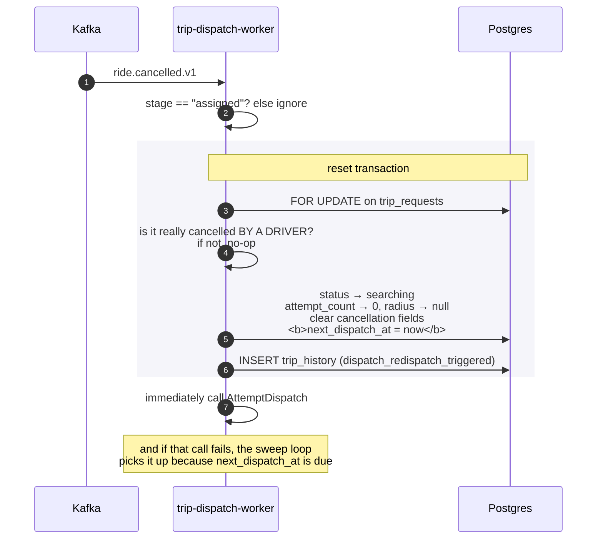
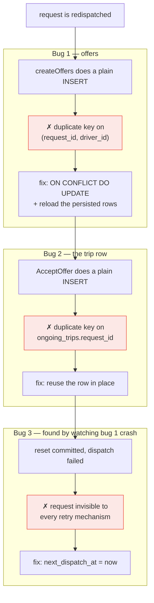
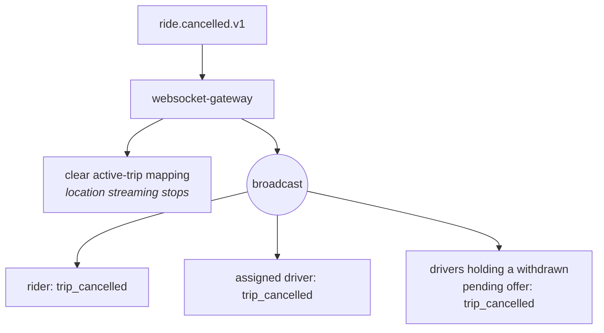

# Cancellation and Redispatch

What happens when someone backs out. Either party can cancel, at several
different points, and what "cancel" *means* changes depending on when it
happens — a driver bailing before pickup and a driver bailing mid-trip are
completely different events for the rider.

This document also covers **redispatch**: the system automatically finding a
replacement driver, which turned out to be the single most invasive feature in
the codebase because it broke an assumption nearly every other component had
quietly been built on.

Prerequisites: `cab-request-flow.md`, `dispatch-and-matching.md`.

---

## 1. Who can cancel, and when



| Stage | Rider | Driver | Consequence |
|---|---|---|---|
| `searching` / `offered` | ✅ | — | Pending offers withdrawn, search stops |
| `assigned` | ✅ | ✅ | If the **driver** cancels → automatic redispatch |
| `in_progress` | ✅ | ✅ | Terminal — no replacement possible |
| `awaiting_payment` | ❌ | ❌ | The service was delivered; cancelling would erase a debt |
| `timed_out` | ❌ | — | Already terminal |

Two endpoints, deliberately asymmetric in what they are keyed on:

- `POST /api/v1/cab/request-cab/{request_id}/cancel` — the rider may cancel
  before any trip exists, so it is keyed on the **request**.
- `POST /api/v1/driver-trips/ongoing-trips/{ongoing_trip_id}/cancel` — a
  driver only ever attaches via acceptance, so it is keyed on the **trip**.

A reason may be given, validated against a fixed enum (`rider_absent`,
`rider_requested`, `vehicle_problem`, `unsafe_destination`, `other`), plus an
optional free-text note. The reason is optional on the rider side — their app
has no reason picker during search — but is still validated when present.

## 2. Rider cancellation

The rider flow has two branches, split on whether a driver has been assigned
yet — which is really a question of *which table is authoritative*.



The `stage` field on the response and the event is what lets clients react
correctly without needing to know the internal state machine — more on that in
section 4.

## 3. Driver cancellation

Structurally similar, with one important difference in **lock ordering**.



### Why the unlocked read exists

This is the subtle part, and it is about avoiding a deadlock that would only
appear under concurrent load.

By the time driver cancellation was built, **four** code paths could lock the
same `trip_requests` / `ongoing_trips` row pair:

| Path | Lock order |
|---|---|
| `AcceptOffer` | `driver_job_offers` → `trip_requests` |
| Rider cancel (post-assignment) | `trip_requests` → `ongoing_trips` |
| `AttemptDispatch` | `trip_requests` only |
| Driver cancel (new) | needed both |

Two transactions taking locks on the same two tables in **opposite orders** is
the textbook deadlock: A holds table 1 and waits for table 2 while B holds
table 2 and waits for table 1, until the database kills one of them.



The constraint: the driver's endpoint is handed only an `ongoing_trip_id` in
the URL, but the established safe order — set earlier by rider cancellation —
is `trip_requests` first. Locking the ID you were handed is the obvious move
and would have been exactly backwards.

The resolution is a plain unlocked `SELECT request_id FROM ongoing_trips WHERE
id = ?` purely to discover the foreign key, then locking in the established
order and doing all real validation on the second, *locked* read of
`ongoing_trips`. The first read is untrusted — it is a pointer lookup, nothing
more.

The lesson worth taking from this: **lock order is a cross-cutting invariant,
not a property of one file.** The code change was tiny. The work was reading
three unrelated call sites carefully enough to notice the constraint existed.

## 4. What "cancel" means at each stage

Rider cancellation has a clean symmetric story: cancel means terminate,
always. Driver cancellation does not, and conflating the cases would have been
wrong in both directions — auto-rebooking someone already sitting in the car
is nonsense, while making a pre-pickup rider manually re-request is worse
service than necessary.

The decision, made explicitly before any code was written:

| Driver cancels at | Behaviour | Why |
|---|---|---|
| `assigned` (pre-pickup) | **Automatic redispatch** | The rider is still standing on a kerb. The system can fix this without them lifting a finger. |
| `in_progress` (mid-trip) | **Terminate only** | No replacement driver can teleport into a moving car. The rider must re-request. |

This raised an obvious follow-on: does the rider get a jarring "trip
cancelled" push seconds before a new driver appears?

It turned out no new plumbing was needed. The `stage` field already on the
`RideCancelledV1` event — added for entirely unrelated reasons — reaches the
rider's client, so the app can distinguish "finding you another driver" from
"trip ended" without any schema change, event change, or gateway change. Worth
checking what a system already carries before assuming a feature needs new
fields.

## 5. Redispatch

When a driver cancels pre-pickup, `trip-dispatch-worker` consumes
`ride.cancelled.v1` and puts the request back in the pool.



The reset is **guarded on the database's own state**, not on trusting the
event: only a request that is genuinely `cancelled` *and* has
`cancelled_by = driver` gets reset. A stale, duplicated, or redelivered
message is a safe logged no-op.

### The stuck-forever request

Notice `next_dispatch_at = now` rather than `null` in that reset. That single
value is a bug fix, and the story behind it is instructive.

The reset transaction and the immediate `AttemptDispatch` call are **two
separate transactions**. During development, `AttemptDispatch` crashed (from
the constraint violation described in section 6) *after* the reset had already
committed with `next_dispatch_at = null`.

The result was a request in a state no recovery mechanism could see:

- **Kafka redelivery** would not help — the reset is deliberately idempotent,
  so replaying the message is a no-op.
- **The sweep loop** only scans rows where `next_dispatch_at` is non-null and
  due, so it never looked at this row.

A request stuck in `searching` forever, silently, with the only error already
scrolled off in a log. Setting `next_dispatch_at = now` makes the sweep loop a
genuine safety net: the synchronous call still gives the happy path low
latency, and the unhappy path degrades into the same retry mechanism
everything else already relies on.

This was found only because the crash was left to run its course once, and the
next question asked was *"what state did that leave the data in?"* rather than
*"does my fix make the demo pass?"* A happy-path-only verification would have
shipped it invisibly.

## 6. The constraints redispatch broke

This is the centrepiece of the whole feature. Every dispatch-related path in
the codebase had been written under one unstated assumption:

> **A trip request gets dispatched, resolved, and that is the end of it.**

Redispatch broke that assumption for the first time, and two uniqueness
constraints that had literally never been exercised twice failed immediately —
but only when run end to end, not from reading the code.



### Bug 1 — `driver_job_offers (request_id, driver_id)`

`createOffers` inserted plainly. That had always been safe, because the only
way a request previously re-entered dispatch was the retry sweep — which runs
*only* when zero candidates were found, meaning no offer rows existed for
anybody yet.

Redispatch is the first path that resets a request to `searching` *after*
offers already exist and have partially resolved (one `accepted`, the rest
`withdrawn`). The second dispatch finds the same nearby drivers, tries to
insert again, and the entire transaction rolls back:

```
ERROR: duplicate key value violates unique constraint
       "idx_driver_job_offers_request_driver"
```

The fix is `ON CONFLICT (request_id, driver_id) DO UPDATE`, resetting the row
to a fresh pending offer — **plus** re-querying the persisted rows before
building the Kafka event. On the conflict path the row that survives keeps its
*original* primary key, not the client-side `uuid.New()` generated for the
insert attempt. Trusting the in-memory struct would have published a
`job_offer_id` that does not exist in the database — surfacing much later as a
driver tapping accept on a freshly-pushed offer and getting a 404.

### Bug 2 — `ongoing_trips.request_id`

With bug 1 fixed, the *replacement* driver's accept call failed for the same
underlying reason. `ongoing_trips` permits exactly one row per `request_id`,
forever, and the cancelled driver's row already occupies that slot.

This one had a real design choice behind it:

| Option | Consequence |
|---|---|
| Relax the constraint — allow many rows per request | Ripples into every lookup that assumes "*the* ongoing trip for this request", starting with rider cancellation's own lookup, which would need to start filtering for "the current one". |
| **Reuse the row in place** | No migration, no changes anywhere else. |

Reuse won, and the deciding argument is that `ongoing_trips` was never meant
to be a ledger — `trip_history` already is one. The full sequence
(`driver_accepted` → `driver_cancelled` → `dispatch_redispatch_triggered` →
`driver_accepted`) is already recorded there. Making a second table into a
second, partial history would have duplicated that for no gain.

Reassignment therefore resets the row completely: new driver, new vehicle,
status back to `assigned`, and a freshly generated start PIN — so the
cancelled driver's PIN can never be used to start the replacement trip.

## 7. Keeping a cancelled driver out of the retry

A driver who just abandoned a job must not be the "fix" the system offers the
same rider ten seconds later.

Two obvious implementations were considered and rejected:

| Option | Why not |
|---|---|
| A new column on `trip_requests` listing excluded drivers | A schema migration coordinated across two repos, for a fact already being written elsewhere. |
| A Redis key with a short TTL | Adds a Redis dependency to a service that has never needed one — and the exclusion is not actually time-boxed. It should last for the entire remaining life of *that request*, not some arbitrary window. |

What shipped instead reuses data the system was already recording. Every
driver cancellation writes a `trip_history` row carrying `event_type =
'driver_cancelled'`, the `request_id` and the `driver_id` — because the audit
trail needs it regardless. So the nearest-driver query gained one more clause:

```sql
AND NOT EXISTS (
    SELECT 1 FROM trip_history th
    WHERE th.request_id = ?
      AND th.driver_id  = cd.driver_id
      AND th.event_type = 'driver_cancelled'
)
```

Zero new schema, zero new infrastructure, zero new write paths. The audit log
*is* the exclusion list, and the exclusion naturally scopes to exactly the
right lifetime.

## 8. A safety fact, recorded but not yet acted on

When a driver cancels mid-trip, the system records how far the rider is from
their destination — a genuine passenger-safety signal — while explicitly not
building any reactive behaviour (SOS, alerts, route-divergence detection)
around it yet.

The tension is capturing data that will be useful later without overbuilding
"later" now. The answer was to keep it entirely inside the existing
`trip_history` row: no new event field, no new consumer, nothing the gateway
needs to know. It is computed from the driver's last known GPS ping — already
collected for dispatch — as a straight-line distance to the dropoff.

That Haversine formula already existed elsewhere in the codebase, but in a
different Go module. These are independently versioned services in a
workspace, so it was duplicated as a fifteen-line local function rather than
justifying a new shared dependency for one formula. Small deliberate
duplication beats a premature shared package.

## 9. What clients see



This is the only push in the system with more than one audience — its
deliverer is the only one holding references to both the rider hub and the
driver hub. The event carries `withdrawn_offer_driver_ids` so drivers who were
mid-decision get their card cleared instead of tapping accept on a job that no
longer exists.

Riders who miss the push still see the truth via `GET /current-trip`.

## 10. The recurring theme

Across all of the above, one pattern dominates:

> **The hard part was rarely writing new code. It was recognising an existing
> invariant — a lock order, a uniqueness constraint, an event field, an audit
> table — that a new feature was about to violate, or could reuse instead of
> duplicate.**

Three of the sections above end with "no schema change, no new event field, no
new dependency," specifically because the right fix was to look harder at what
the system already tracked rather than adding another mechanism to track it
again.

## 11. Known limitations

- **No cancellation fee, no penalty.** Cancellations are counted in the
  driver's stats and nothing else happens.
- **No rate limiting.** Nothing stops a rider from cancelling and re-booking
  repeatedly.
- **Redispatch restarts from scratch.** Attempt count resets to zero and
  radius to the initial value — the replacement search gets a full five
  attempts, as though it were a brand-new request.
- **Mid-trip cancellation has no safety response.** The distance-to-dropoff is
  recorded and nothing reads it.
- **`awaiting_payment` cannot be cancelled by anyone**, including support.
  There is no fare-dispute or waiver path.
