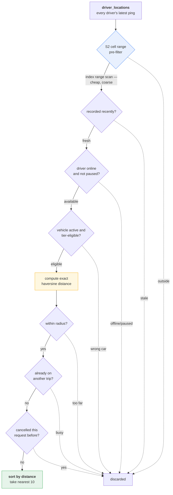
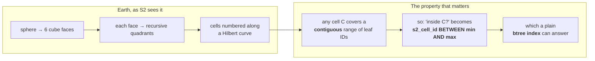
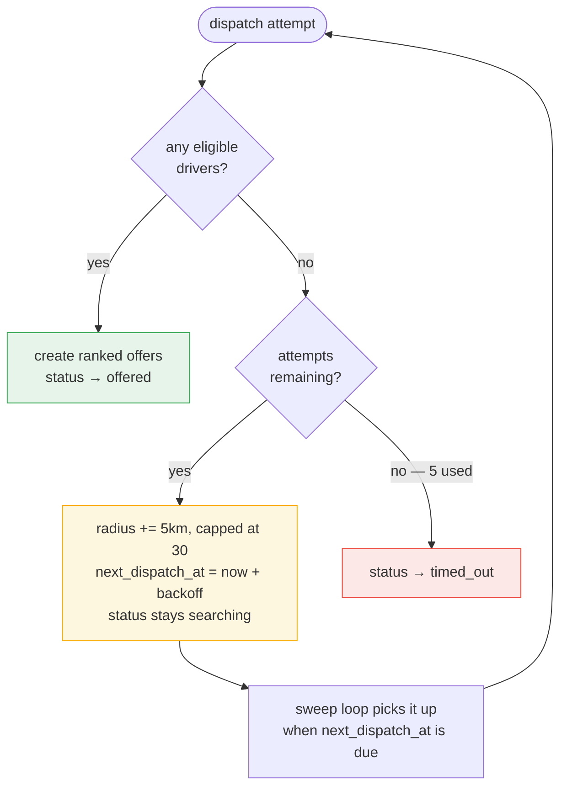
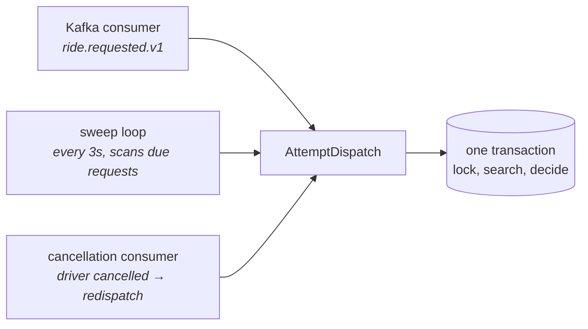

# Dispatch and Matching

How `trip-dispatch-worker` decides which drivers are offered a job. This is
the most algorithmically interesting part of the platform: a geospatial
search, an eligibility filter, and a retry policy, all running inside one
database transaction.

Prerequisite: `cab-request-flow.md` section 5.

---

## 1. The problem

Given a pickup point, find the drivers who should be offered this job.
"Should" is doing a lot of work in that sentence. A driver qualifies only if
*all* of the following hold:

1. They are physically **near** the pickup.
2. Their location is **recent** — a two-hour-old GPS ping tells us nothing.
3. They are **online** and not **paused**.
4. Their car **matches the tier** the rider paid for.
5. They are **not already on a trip**.
6. They have **not already cancelled this exact request**.

Miss any one of these and the system produces a visible failure: offering a
premium booking to a hatchback, offering a job to a driver who went home two
hours ago, or re-offering a job to the driver who just abandoned it.

## 2. The query, conceptually



The ordering matters enormously. The **cheap, index-backed filters run
first**; the expensive trigonometry runs only on what survives them.

## 3. The geospatial problem, and how S2 solves it

### Why the naive approach does not scale

The obvious way to find nearby drivers is to compute the distance to every
driver and keep the close ones:

```sql
SELECT driver_id, haversine(...) AS distance_km
FROM driver_locations
WHERE distance_km <= 20
```

This is a **full table scan with trigonometry on every row**, executed on
every dispatch attempt, every retry, and every sweep tick. With a hundred
test drivers it is invisible. With a hundred thousand it is the whole system.

The usual fix is PostGIS with a GiST index. This schema does not have
PostGIS. So the pre-filter had to be built from what the table already
stores.

### What the table already stores

Every `driver_locations` row carries two derived location columns, written at
ingest time:

| Column | What it is | Useful for range queries? |
|---|---|---|
| `geohash` | An S2 cell **token** at level 16, stored as trimmed hex | **No.** `ToToken()` strips trailing zero nibbles, so the strings are variable-width — prefix and range comparisons are not meaningful. And level 16 cells are under 1 km², so covering a 20 km radius would need thousands of exact matches. |
| `s2_cell_id` | The **leaf-level (level 30) S2 cell ID**, a 64-bit integer | **Yes.** This is exactly what S2's indexing scheme is designed around. |

The intuition behind S2: it projects the sphere onto six cube faces and
recursively subdivides each face into quadrants, numbering cells along a
Hilbert curve. The curve's defining property is that **every descendant of a
cell occupies a contiguous range of leaf-cell IDs**. So for any coarse cell
`C`, `C.RangeMin()` and `C.RangeMax()` bound every point inside it — and
"is this point inside this region?" becomes a plain numeric `BETWEEN`.



### The one schema change this needed

`s2_cell_id` was originally `VARCHAR(32)`, which made `BETWEEN` a
*lexicographic* comparison — wrong for numeric ranges. Migration `000015`
converts it to `NUMERIC(20,0)`.

Not `BIGINT`: leaf-level S2 IDs are unsigned 64-bit and can exceed Postgres's
signed `BIGINT` maximum of 2⁶³−1. `NUMERIC(20,0)` holds the full unsigned
range.

### How the pre-filter is built

For a given pickup and radius, the worker computes an S2 *covering* — a small
set of cells (capped at 8) whose union contains the search disc:

```go
cap := s2.CapFromCenterAngle(center, s1.Angle(radiusKM/earthRadiusKM))
coverer := &s2.RegionCoverer{MinLevel: 0, MaxLevel: s2.MaxLevel, MaxCells: 8}
for _, cellID := range coverer.Covering(cap) {
    mins = append(mins, strconv.FormatUint(uint64(cellID.RangeMin()), 10))
    maxs = append(maxs, strconv.FormatUint(uint64(cellID.RangeMax()), 10))
}
```

`RegionCoverer` picks cell levels adaptively to hit roughly `MaxCells`
regardless of radius, so no manual level-versus-radius tuning is needed. Those
ranges become an OR-block of `BETWEEN` clauses in the query:

```sql
AND ( (dl.s2_cell_id BETWEEN ? AND ?)
   OR (dl.s2_cell_id BETWEEN ? AND ?)
   OR ... )   -- at most 8 pairs
```

**A covering is an over-approximation.** Cells are square-ish, the search area
is a disc, so the covering includes drivers slightly outside the radius. That
is fine and intentional: the covering's job is to cheaply shrink the candidate
set, and the exact `distance_km <= radius` check downstream still makes the
final cut. The covering is recomputed on every attempt, because the radius
grows between retries.

If the covering comes back empty — which should not happen for a valid radius
— the geo pre-filter is skipped entirely and the query falls back to scanning
fresh rows. Degraded, never wrong.

## 4. The eligibility filters

### Freshness as a proxy for availability

```sql
WHERE dl.recorded_at >= (now - DRIVER_LOCATION_FRESH_WINDOW)   -- default 300s
```

A driver whose last ping is older than five minutes is treated as gone. This
is a proxy, not a presence system: there is no heartbeat channel, so "has
their phone told us where they are recently?" stands in for "are they
there?".

### Online and paused — the explicit flags

```sql
JOIN drivers d ON d.id = dl.driver_id
WHERE d.is_online = true AND d.is_paused = false
```

This closes a real gap. Before these columns existed, `is_online` was never
consulted anywhere in dispatch. A driver who tapped "go offline" but whose app
kept streaming location — or whose last ping was still inside the freshness
window — could still be matched and offered rides. Going offline appeared to
work only because most driver apps also stop the location stream on that same
tap. The backend itself never enforced it.

`is_paused` is the softer variant: a driver taking a break stays online but
receives no offers.

### Tier eligibility

`trip_requests.service_type` is denormalized from the booked quote, so
dispatch does not need to join `trip_fares` to know what the rider paid for.

```sql
JOIN vehicles v ON v.driver_id = dl.driver_id AND v.is_active = true
WHERE (
      ? = 'RIDE'
   OR (? = 'RIDE_XL'      AND v.seat_count >= 6)
   OR (? = 'RIDE_PREMIUM' AND v.category = 'luxury')
)
```

| Tier | Requirement |
|---|---|
| `RIDE` | Any active vehicle — this is the floor tier |
| `RIDE_XL` | `seat_count >= 6` |
| `RIDE_PREMIUM` | `category = 'luxury'` |

This is a **floor, not an exact match**, and the asymmetry is deliberate. A
luxury car may serve a standard request — nobody complains about an upgrade.
A standard car must never serve a premium request — the rider paid for the
nicer car and will notice. Enforcing an exact match would shrink the
available pool for no benefit; enforcing nothing would let a hatchback take a
premium booking.

### Exclusions

```sql
AND NOT EXISTS (SELECT 1 FROM ongoing_trips ot
                WHERE ot.driver_id = cd.driver_id
                  AND ot.status IN ('assigned','driver_arriving',
                                    'in_progress','awaiting_payment'))
```

Note that `awaiting_payment` counts as busy: the trip is physically over but
the driver is still standing with the rider waiting on cash, and must not be
handed a new job.

```sql
AND NOT EXISTS (SELECT 1 FROM trip_history th
                WHERE th.request_id = ?
                  AND th.driver_id  = cd.driver_id
                  AND th.event_type = 'driver_cancelled')
```

This second exclusion is quietly elegant. When a request is redispatched after
its driver cancelled, that driver must not be offered the same job again — they
would just cancel again. Rather than adding a column, a Redis set, or a TTL,
the query reuses the audit trail that was already being written for entirely
different reasons. The `trip_history` row that records the cancellation *is*
the exclusion list.

## 5. What happens when nobody is found

A failed search is not a failure — most requests at the edge of a coverage
area need a second or third look.



| Attempt | Radius | Wait before next |
|---|---|---|
| 1 | 20 km | 2 s |
| 2 | 25 km | 4 s |
| 3 | 30 km | 8 s |
| 4 | 30 km (capped) | 16 s |
| 5 | 30 km | — times out |

Radius grows linearly (`+5 km`, capped at 30); backoff grows exponentially
(`2ⁿ`, capped at 30 s). The reasoning differs for each: geography is roughly
quadratic in radius so small steps already add a lot of area, while the *cost*
of retrying is constant, so backing off aggressively is free.

All of this state — `dispatch_attempt_count`, `dispatch_radius_km`,
`next_dispatch_at` — lives in columns on `trip_requests`, not in worker
memory. A worker restart mid-search loses nothing.

### Two entry points, one code path



The initial attempt, every retry, and post-cancellation redispatch all call
the same `AttemptDispatch(ctx, requestID)`. There is exactly one
implementation of the matching rules, so the retry path cannot drift from the
first-attempt path.

The two loops fail differently, by design. The Kafka consumer can let an error
propagate — the message is uncommitted and will be redelivered. The sweep loop
has no such safety net, so its errors are logged and swallowed per item and
per tick: a transient database blip must never kill the goroutine and silently
stop all retries platform-wide.

## 6. Creating the offers

When candidates are found, the worker bulk-inserts one `driver_job_offers` row
per driver, ranked 0-based by ascending distance, each with a TTL (default 15
seconds).

The insert is an **upsert**, not a plain insert:

```go
tx.Clauses(clause.OnConflict{
    Columns:   []clause.Column{{Name: "request_id"}, {Name: "driver_id"}},
    DoUpdates: clause.AssignmentColumns([]string{"offer_rank", "status", ...}),
}).Create(&offers)
```

`(request_id, driver_id)` is uniquely indexed for the request's lifetime. On
a redispatch, the same nearby drivers are usually found again — including the
ones whose earlier offers are sitting in `withdrawn`. A plain insert would
violate the constraint and crash the whole dispatch. The upsert resets the
existing row into a fresh pending offer instead.

The offers are then **reloaded** from the database rather than trusting the
in-memory structs. On the conflict path, the row that actually persisted keeps
its *original* primary key, not the freshly generated UUID — and that original
`job_offer_id` is what downstream consumers and the driver's accept call must
reference.

## 7. What the driver actually sees

The published `driver.job_offer.created.v1` event is one batch per dispatch
attempt, enriched so the gateway's push path needs no joins:

| Field | Source |
|---|---|
| `rider_name` | joined from `users` |
| `pickup` / `dropoff` | denormalized from the request |
| `trip_distance_km`, `trip_duration_minutes` | the fare's real route, when one exists |
| `pickup_distance_km` | the Haversine distance the search already computed — no extra query |
| `pickup_eta_minutes` | that distance ÷ configured average speed |
| `estimated_earning` | `total_fare × (1 − commission_rate)`, default 20% |

`estimated_earning` is a forecast, not a ledger entry. There is no payout
model in the schema; it is a straight percentage computed at read time so a
driver can judge whether a job is worth taking.

## 8. Configuration

| Variable | Default | Controls |
|---|---|---|
| `NEAREST_DRIVERS_LIMIT` | 10 | Offers created per attempt |
| `DRIVER_LOCATION_FRESH_WINDOW_SECONDS` | 300 | Availability proxy window |
| `DISPATCH_INITIAL_RADIUS_KM` | 20 | Starting search radius |
| `DISPATCH_RADIUS_STEP_KM` | 5 | Growth per retry |
| `DISPATCH_MAX_RADIUS_KM` | 30 | Radius ceiling |
| `DISPATCH_MAX_ATTEMPTS` | 5 | Before timing out |
| `DISPATCH_BACKOFF_BASE_SECONDS` | 2 | Exponential base |
| `DISPATCH_BACKOFF_MAX_SECONDS` | 30 | Backoff ceiling |
| `JOB_OFFER_TTL_SECONDS` | 15 | How long a driver has to accept |
| `DISPATCH_SWEEP_INTERVAL_SECONDS` | 3 | Retry poll frequency |
| `DRIVER_COMMISSION_RATE` | 0.20 | Platform cut in the earnings estimate |
| `PICKUP_ETA_AVERAGE_SPEED_KPH` | 30 | ETA assumption |

## 9. Scaling constraint

**`trip-dispatch-worker` is pinned to one replica**, and its Helm chart says
so explicitly.

The Kafka consumer half would be fine at higher replica counts — consumer
groups give each partition to exactly one member. The **sweep loop** is the
blocker: it scans for due requests without any coordinating lock, so two
replicas would both pick up the same request. The per-request dispatch
transaction *is* row-locked, so the outcome would still be correct — but one
replica would do redundant work and log a confusing no-op every tick.

Fixing this properly means an advisory lock, a leader election, or sharding
the sweep by request-ID range. None is built; the single replica is the
current answer.

## 10. Known limitations

- **Distance-first, not ETA-first.** Ranking is straight-line distance. A
  driver 2 km away across a river may be ranked above one 3 km away on the
  same road. Real ETA ranking would need a routing call per candidate.
- **No supply-side fairness.** No consideration of how long a driver has been
  idle, their acceptance rate, or earnings balance. Nearest wins.
- **No surge, no demand awareness.** Dispatch does not know or care how many
  requests are competing for the same drivers.
- **The freshness window is a guess.** Five minutes is generous enough to
  survive a tunnel and long enough to offer a job to someone who just parked
  and walked away.
- **All ten offers go out at once.** No sequential waterfall to the nearest
  driver first. Simpler, faster to fill, but it means nine drivers get a card
  that is about to be withdrawn.
