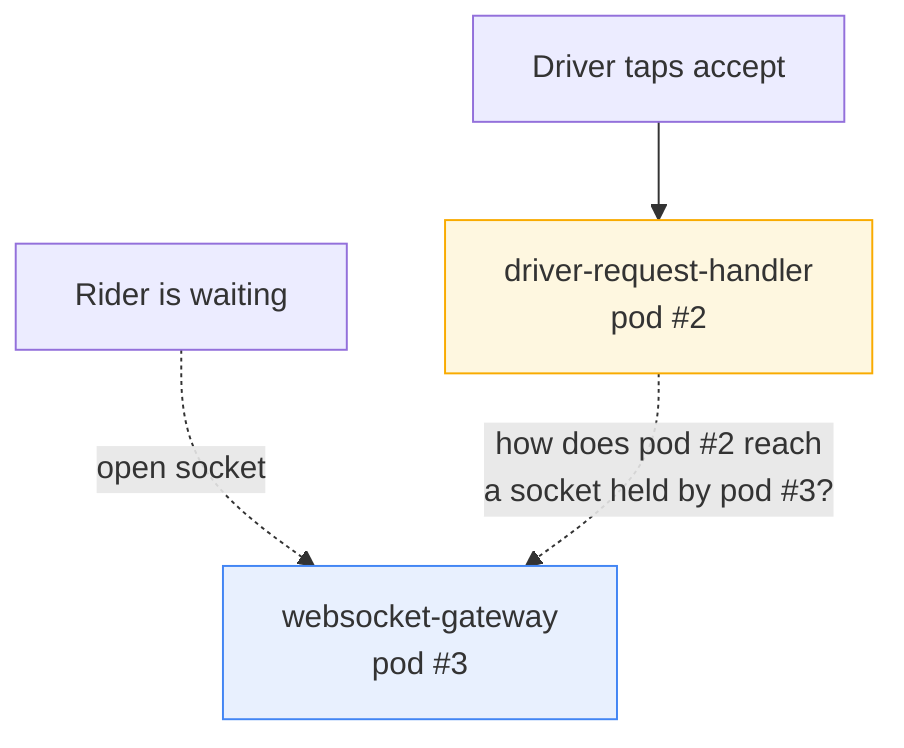
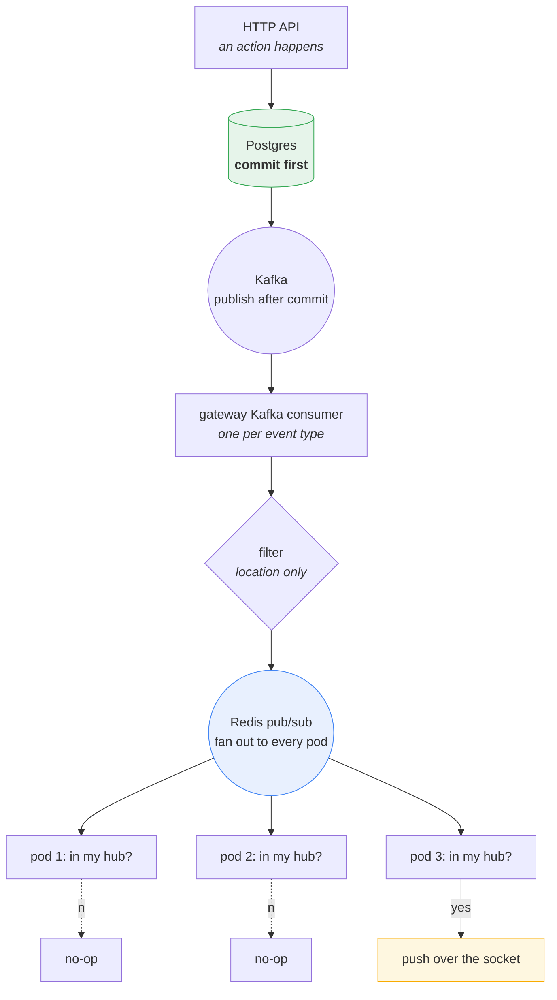
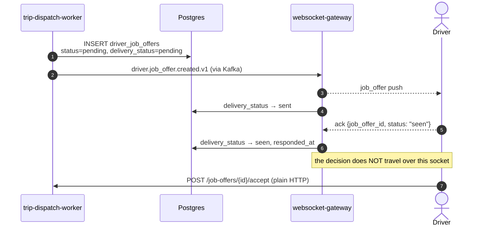
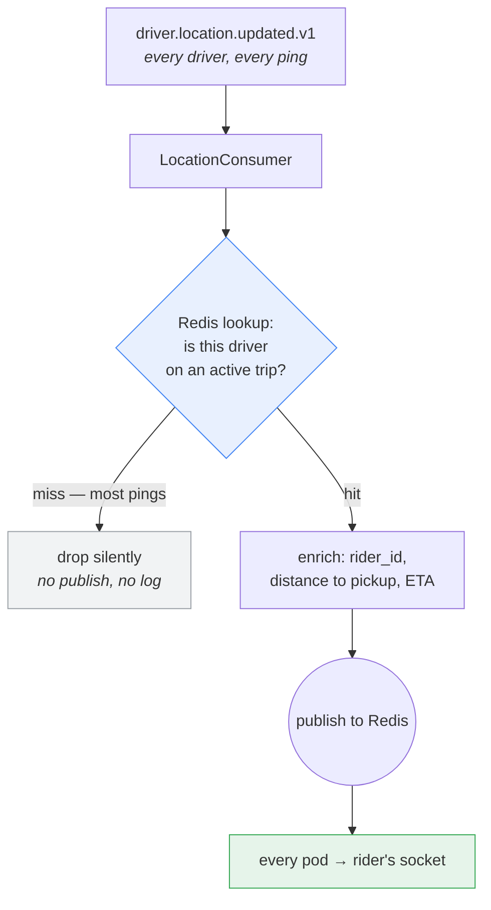
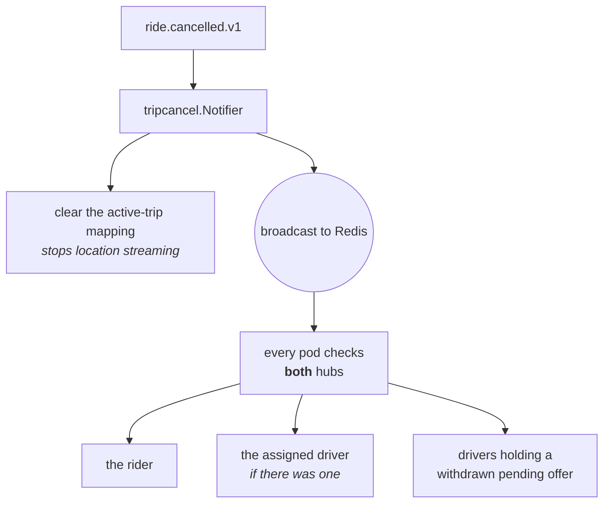
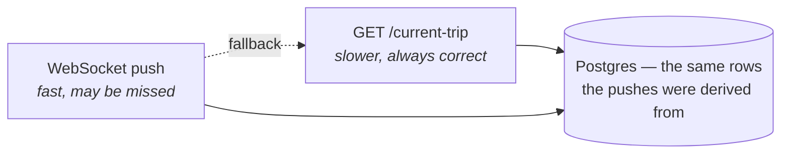

# Driver ⇄ Rider Realtime Communication

How a driver's action becomes something the rider sees on screen a moment
later, and vice versa. This document covers the **delivery layer** — what
gets pushed over the wire, to whom, and how it finds the right socket.

Prerequisite: `architecture-overview.md`. For what the events *mean*, see
`cab-request-flow.md`.

---

## 1. The routing problem

Start with the thing that makes this non-trivial.

A driver taps "accept". Their HTTP request lands on one of several
`driver-request-handler` pods. The rider who needs to hear about it is holding
an open WebSocket to one of several `websocket-gateway` pods. **These are
different machines, and neither knows about the other.**

Three common answers, and why none is used here:

| Approach | Why not |
|---|---|
| **Sticky sessions** — pin a user to a pod | Requires a load balancer that understands user identity, and breaks the moment that pod restarts. |
| **Shared connection registry** — "rider X is on pod 3" in Redis | Now every push needs a lookup plus a directed message, and the registry can go stale whenever a pod dies uncleanly. |
| **Direct service-to-service call** | Reintroduces exactly the coupling Kafka was adopted to remove. |

The approach actually used is simpler than all three:

> **Broadcast to every gateway pod, and let each one check its own memory.**

Each pod holds its connections in a plain in-memory map. When an event
arrives, *every* pod receives it, looks up the target user in its own hub, and
pushes only if it happens to hold that connection. A miss is a no-op costing a
map lookup.

Because a user's connection lives on exactly one pod at a time, exactly one
pod pushes. No registry, no stickiness, no stale state. The cost is that all
pods see all events — which is why the location firehose gets special
treatment (section 6).

## 2. The pipeline

Every stage exists for a reason:

- **Postgres commit first.** The rule is absolute: no service publishes to
  Kafka before its transaction commits. A client can therefore never be told
  about a state the database has not durably recorded.
- **Kafka** decouples the producing service from the gateway entirely. The
  gateway can restart, scale, or fall behind without the accepting driver's
  HTTP call knowing or caring.
- **Redis pub/sub** solves the intra-gateway fan-out. Kafka *cannot* do this
  job: all gateway pods share a consumer group, so a Kafka message goes to
  exactly one pod — the wrong tool for "tell everyone".

That last point is the subtle one. Kafka's delivery model (one consumer per
partition per group) is precisely what you want for *processing* and
precisely what you do not want for *broadcasting*. The two systems are doing
genuinely different jobs.

## 3. Connections

| Client | Endpoint | Requires |
|---|---|---|
| Driver app | `GET /api/v1/ws/driver?token=<jwt>&device_id=<id>` | `role=driver` |
| Rider app | `GET /api/v1/ws/rider?token=<jwt>&device_id=<id>` | `role=rider` |

**Why the token is a query parameter.** WebSocket upgrade handshakes cannot
reliably carry custom headers across all client platforms. The token is
verified before the upgrade completes; a bad one never becomes a connection.

**Why `device_id` exists.** Hubs key connections as `user_id → device_id →
connection`, so one person can be connected from a phone and a tablet
simultaneously and both receive pushes.

Two separate hubs exist — `Hub` for drivers, `RiderHub` for riders — because
the two populations receive almost entirely disjoint message sets, and
separating them makes the "who is this for?" question structural rather than
conditional.

Liveness is maintained with ping/pong: the server pings every 20 seconds and
drops a connection that has not ponged within 60.

## 4. The eight pipelines

Each event type has its own Kafka consumer, its own Redis channel, and its own
Go package. Deliberately repetitive: one pipeline's failure cannot affect
another's, and adding a ninth means copying a pattern rather than modifying
shared machinery.

| # | Kafka topic | Published by | Redis channel | WS message | Goes to |
|---|---|---|---|---|---|
| 1 | `driver.job_offer.created.v1` | trip-dispatch-worker | `driver-offers` | `job_offer` | matched drivers |
| 2 | `driver.job_offer.withdrawn.v1` | driver-request-handler | `driver-offer-withdrawn` | `offer_withdrawn` | losing drivers |
| 3 | `ride.assigned.v1` | driver-request-handler | `ride-assignments` | `ride_assigned` | rider |
| 4 | `driver.location.updated.v1` | location-producers | `driver-location-updates` | `driver_location` | rider, **if mid-trip** |
| 5 | `ride.started.v1` | driver-request-handler | `trip-started` | `trip_started` | rider |
| 6 | `ride.ended.v1` | driver-request-handler | `trip-ended` | `trip_ended` | rider |
| 7 | `ride.completed.v1` | driver-request-handler | `trip-completed` | `trip_completed` | rider |
| 8 | `ride.cancelled.v1` | cab-request-handler *or* driver-request-handler | `trip-cancelled` | `trip_cancelled` | rider **and** driver |

The gateway runs nine goroutines: eight consumers plus the HTTP server.

## 5. Job offers — the one message with a protocol

Seven of the eight pushes are fire-and-forget. Job offers are different,
because a driver has to *respond* to one, and a missed offer means a rider
waits for a car that was never really offered.

### Two status columns, two owners

`driver_job_offers` carries two separate status fields, and the split is a
deliberate ownership boundary:

| Column | Values | Written by |
|---|---|---|
| `delivery_status` | `pending → sent → delivered/seen` | **the gateway only** — transport bookkeeping |
| `status` | `pending / accepted / rejected / expired / withdrawn` | **dispatch and driver-request-handler only** — business truth |

The gateway never writes `status`. It is a transport, and transports should
not have opinions about whether a job was accepted. This means a gateway bug
can lose a *notification* but can never corrupt a *trip*.

### Reconnect replay — why offers survive a dead phone

On **every** successful driver connection — first connect and reconnect are
handled identically — the gateway queries Postgres for that driver's pending,
unexpired offers and re-pushes them.

That query, not any in-memory queue, is the durable source of truth. A driver
whose phone died when an offer was created still sees it on reconnect, as long
as it has not expired. Nothing is buffered anywhere, so nothing can be lost by
a pod restart.

### Why acceptance is HTTP, not WebSocket

The accept decision travels over a plain HTTP `POST`, not the open socket the
offer arrived on. That is not an oversight:

- Accepting needs a **transactional, first-wins lock** and a synchronous
  success/failure answer. HTTP's request/response shape fits that exactly.
- A WebSocket frame has no natural response channel, so the driver's app would
  need a correlation-ID protocol to learn whether it won.
- It keeps the gateway a pure transport. Business decisions live in the
  service that owns the data.

The wire format *does* parse `accepted` and `rejected` acknowledgement values,
so a future move needs no protocol change — but today they only record
`responded_at` bookkeeping.

## 6. Location — filtering before fan-out

This pipeline is architecturally different from the other seven, and the
difference is the most important scaling decision in the gateway.

**The problem.** `driver.location.updated.v1` is a fleet-wide, continuous
firehose: every driver, every ping, whether idle or mid-trip. The other topics
are low-volume and event-shaped. If the location stream used the same
broadcast-then-filter pattern, every gateway pod would receive a Redis message
for every idle driver's every GPS ping — work scaling with *fleet size*, when
the useful work scales only with *active trips*.

**The fix.** Filter *before* publishing to Redis, not after.

A small Redis key-value store holds `driver_id → {rider_id, trip_id,
ongoing_trip_id, pickup coordinates, average speed}`, with a two-hour TTL.
Its lifecycle:

| Moment | What happens to the mapping |
|---|---|
| `ride.assigned.v1` handled | **written** — the driver is now heading to a pickup |
| `ride.started.v1` handled | **cleared** — rider is in the car; pings add nothing |
| `ride.cancelled.v1` handled | **cleared** — no trip left to track |
| Two hours pass | **expires** — the backstop if a clear was ever missed |

So live location streams exactly during the window it is useful: from
acceptance to pickup. Every ping outside it costs one Redis lookup and is
dropped — no fan-out, no log line (logging at this volume would itself be the
problem).

**Enrichment on the way through.** Each forwarded ping is recomputed into a
straight-line distance to the pickup and an ETA. The average speed comes from
the trip's real route when the fare had one (`route_distance ÷
route_duration`), falling back to a configured constant otherwise. So the
rider's "4 min away" reflects that specific route's actual traffic profile,
not a global guess.

## 7. Cancellation — the only push with two audiences

Every other message has one recipient type. `trip_cancelled` may need to reach
three groups at once, depending on when the cancel happened:

Its deliverer is the only one holding references to both the rider hub and the
driver hub. The event carries a `withdrawn_offer_driver_ids` list precisely so
drivers who were mid-decision get their card cleared rather than tapping
accept on a job that no longer exists.

## 8. Message catalogue

| Type | Direction | Carries | Ack? |
|---|---|---|---|
| `job_offer` | → driver | rider name, pickup/dropoff, trip distance and duration, this driver's pickup distance and ETA, estimated earning, expiry | **yes** |
| `offer_withdrawn` | → driver | request and trip IDs | no |
| `ride_assigned` | → rider | driver name and last location, vehicle colour/plate/model, **start PIN**, route | no |
| `driver_location` | → rider | coordinates, accuracy, live distance remaining and ETA | no |
| `trip_started` | → rider | started time, vehicle details | no |
| `trip_ended` | → rider | **final fare**, currency | no |
| `trip_completed` | → rider | final fare, payment collected time | no |
| `trip_cancelled` | → rider and driver | stage, who cancelled, when | no |

## 9. Reliability model

**At-least-once, best-effort, with a polling floor.**

Both apps poll `/current-trip` as a backstop. A missed push costs immediacy,
never correctness — because the push and the poll read the same underlying
state.

### No cross-topic ordering guarantee

Kafka orders messages within a partition, not across topics. `ride.assigned.v1`
and the first `driver.location.updated.v1` after it can arrive at the gateway
in either order.

If a location ping is processed before its assignment, the active-trip lookup
simply misses and the ping is dropped. The next ping — typically a few seconds
later — finds the mapping and works. This is **accepted behaviour, not a bug**:
the alternative is buffering out-of-order events with reordering windows and
timeouts, to fix a symptom that self-heals in one ping cycle.

### Known gap: Redis has no recovery path

If Redis loses the active-trip map — a flush, a failover to an empty replica —
location streaming stops for every trip currently between acceptance and
pickup, and does not resume. Nothing rebuilds the mapping from Postgres, and
nothing detects its absence.

The blast radius is bounded: no trip state is lost, riders can still poll, and
every *new* assignment repopulates its own entry. But riders mid-approach
silently lose the moving car on their map until their driver arrives. This is
a known gap, not a solved problem.

## 10. Configuration

| Variable | Default | Controls |
|---|---|---|
| `WS_PING_INTERVAL_SECONDS` | 20 | Server ping cadence |
| `WS_PONG_WAIT_SECONDS` | 60 | Silence before dropping a connection |
| `REPLAY_BATCH_SIZE` | 50 | Max offers replayed on reconnect |
| `ACTIVE_TRIP_TTL_SECONDS` | 7200 | Active-trip mapping lifetime |
| `FALLBACK_AVG_SPEED_KPH` | 30 | ETA fallback when no route exists |
| `DRIVER_COMMISSION_RATE` | 0.20 | Earnings estimate on replayed offers |
| `REDIS_*_CHANNEL` | see table in §4 | One per pipeline |

## 11. Scaling properties

| Property | Status |
|---|---|
| Multiple gateway replicas | **Supported.** No sticky sessions, no shared connection state. |
| Pod restart | Connections drop; clients reconnect and replay pending offers from Postgres. |
| Redis outage | Realtime stops; HTTP APIs and polling unaffected. |
| Kafka lag | Pushes arrive late; trip state remains correct throughout. |

The one thing that does **not** scale horizontally is the Redis broadcast
itself: every pod receives every message on every channel. At a large enough
pod count that becomes wasteful, and the fix would be sharded channels — pods
subscribing only to a hash range of user IDs. Not needed at current scale, and
the location filter already removes the highest-volume stream from that
concern.

## 12. Known limitations

- **No driver reject flow.** Drivers let offers expire instead.
- **`offer_version` is hardcoded to 1.** The dedupe key exists in the wire
  format but has no backing column.
- **No delivery receipts for rider pushes.** Only job offers are acknowledged;
  the other seven message types are sent blind.
- **No message replay for riders.** Drivers get offers replayed on reconnect;
  a rider who reconnects must poll `/current-trip` to resynchronise.
