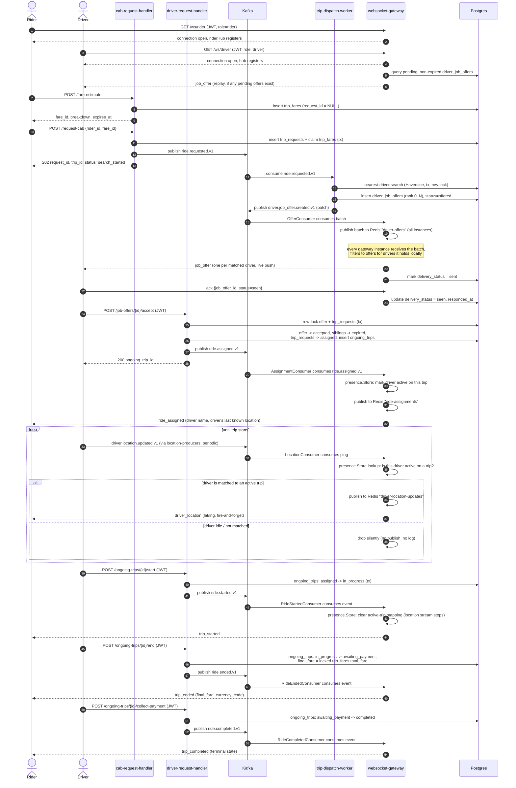

# Driver ⇄ Rider Realtime Communication

How data moves between a driver's app and a rider's app during a trip. Neither
app ever talks to the other directly — every byte crosses through Postgres
and/or Kafka first, and the only realtime transport either client holds open
is a WebSocket connection to `services/websocket-gateway`.

For the full end-to-end request/dispatch design (fare lock, nearest-driver
search, retry/backoff, phase history) see `docs/cab-request-flow.md`. This doc
focuses narrowly on *what gets pushed over the wire and in what order* once a
driver and rider are connected.

## Actors and transport

| Actor | Connects to | Endpoint | Auth |
|---|---|---|---|
| Driver app | `websocket-gateway` | `GET /ws/driver?token=<jwt>&device_id=<id>` | JWT, `role=driver` |
| Rider app | `websocket-gateway` | `GET /ws/rider?token=<jwt>&device_id=<id>` | JWT, `role=rider` |
| Driver app | `driver-request-handler` | `POST /job-offers/{id}/accept`, `/ongoing-trips/{id}/start`, `/end`, `/collect-payment` | JWT, `role=driver` |
| Rider app | `cab-request-handler` | `POST /fare-estimate`, `POST /request-cab`, `GET /current-trip` | JWT, `role=rider` |

The token is a query param (not a header) because the WS upgrade handshake
can't reliably carry custom headers from every client type. `device_id` lets
one driver/rider have multiple simultaneous connections (e.g. phone + tablet);
the hub keys connections by `user_id -> device_id`.

Both hubs (`ws.Hub` for drivers, `ws.RiderHub` for riders) are **in-memory and
per-instance** — a connection lives on exactly one `websocket-gateway` pod.
Cross-instance delivery works because every state change is first written to
Kafka or Postgres, then fanned out to *all* gateway instances over **Redis
pub/sub**; each instance independently checks whether it happens to be
holding the target driver/rider's live connection and only pushes if so. This
is what lets the gateway run as multiple stateless-feeling pods with no
sticky-session requirement — the source of truth for "who's connected to
whom" per event never lives in only one process's memory.

## Data path, end to end

```
driver/rider HTTP APIs → Postgres write + Kafka publish (after commit)
                              │
                              ▼
        websocket-gateway Kafka consumer (one per event type)
                              │
                              ▼
        Redis pub/sub channel (fan out to every gateway instance)
                              │
                              ▼
     each instance: local hub lookup → push over the live WS connection
     (miss = target isn't on this instance, no-op)
```

Six independent Kafka topics feed six independent gateway consumers, each
with its own Redis channel and its own package under `internal/`:

| Kafka topic | Producer | Gateway consumer | Redis channel | WS message | Recipient |
|---|---|---|---|---|---|
| `driver.job_offer.created.v1` | `trip-dispatch-worker` | `internal/kafka.OfferConsumer` | `driver-offers` | `job_offer` | driver(s) |
| `ride.assigned.v1` | `driver-request-handler` (accept) | `internal/kafka.AssignmentConsumer` | `ride-assignments` | `ride_assigned` | rider |
| `driver.location.updated.v1` | `location-producers` | `internal/kafka.LocationConsumer` | `driver-location-updates` | `driver_location` | rider (only if actively matched to a trip) |
| `ride.started.v1` | `driver-request-handler` (start) | `internal/kafka.RideStartedConsumer` | `trip-started` | `trip_started` | rider |
| `ride.ended.v1` | `driver-request-handler` (end) | `internal/kafka.RideEndedConsumer` | `trip-ended` | `trip_ended` | rider |
| `ride.completed.v1` | `driver-request-handler` (collect-payment) | `internal/kafka.RideCompletedConsumer` | `trip-completed` | `trip_completed` | rider |

Every one of these follows the same **publish-after-commit** rule: the
producing service commits its DB transaction first, then publishes to Kafka —
never the other way around, so a WS push can never race ahead of the state it
describes.

### `job_offer` — the one message with an ack protocol

Everything else in the table is fire-and-forget. Job offers are different
because a driver has to *respond* to one:

- Delivery tracking is written straight to `driver_job_offers.delivery_status`
  by the gateway (`internal/offers.Store`): `pending` (set by the dispatcher)
  → `sent` (gateway, on push or replay) → `delivered`/`seen` (gateway, on a
  matching ack frame from the driver).
- The `status` column (`accepted`/`rejected`/`expired`/`withdrawn`) is never
  touched by the gateway — that's `trip-dispatch-worker`/
  `driver-request-handler`'s job exclusively.
- **Reconnect replay**: on every successful `/ws/driver` upgrade (first
  connect and reconnect are handled identically), `internal/offers.Replayer`
  queries Postgres directly for that driver's pending, non-expired offers and
  re-pushes them. This DB query — not any in-memory queue — is the durable
  source of truth, so a driver who was offline when an offer was created
  still sees it the moment they reconnect, as long as it hasn't expired.
- The actual accept decision does **not** go over the WebSocket. The driver
  calls `POST /job-offers/{id}/accept` on `driver-request-handler` over plain
  HTTP; that's what does the first-wins row-locking and publishes
  `ride.assigned.v1`. The `accepted`/`rejected` ack-frame values are parsed by
  the gateway but currently only update `responded_at` bookkeeping — no
  assignment side effects live in the WS path.

### `driver_location` — filtered, not broadcast

`driver.location.updated.v1` is a fleet-wide, continuous, unauthenticated
firehose — every driver, every ping, whether or not they're on a trip.
Naively broadcasting every ping to every gateway instance would be wasteful
at scale, so the gateway filters *before* publishing to Redis:
`internal/presence.Store` holds a Redis-backed `driver_id → {rider_id,
trip_id, ...}` map, written once at assignment time and cleared once the trip
starts (a location ping after pickup adds no value — the rider is now in the
car). Only pings for a driver present in that map get forwarded to the
rider's socket; everything else is a cheap no-op with no Redis publish and no
log line.

## Sequence diagram: full trip lifecycle



## Reliability notes

- **At-least-once, not exactly-once.** All six WS pushes are best-effort
  fire-and-forget except `job_offer`, which has an ack + DB-backed replay.
  Riders have a fallback for everything the gateway might drop: `GET
  /current-trip` on `cab-request-handler` polls the same Postgres tables the
  pushes are sourced from, so a missed `ride_assigned`/`trip_ended` push is
  recoverable by polling, just not instant.
- **No cross-topic ordering guarantee.** `ride.assigned.v1` and the first
  `driver.location.updated.v1` ping after it can arrive at the gateway in
  either order. A location ping processed before its assignment is silently
  dropped (the `presence.Store` lookup simply misses) and self-heals on the
  next ping — accepted behavior, not a bug.
- **Multi-instance safety** comes entirely from Redis pub/sub plus the
  broadcast-then-locally-filter pattern, not from sticky sessions or shared
  connection state. Every gateway pod subscribes to every channel; only the
  pod actually holding the target connection does anything with a given
  message.
- **Not yet built** (see `docs/cab-request-flow.md` Phase 7 for status):
  driver reject endpoint, and proactively notifying *losing* drivers that
  their offer was withdrawn (their offer row does flip to `expired` in the
  DB, they're just not pushed a message about it).
