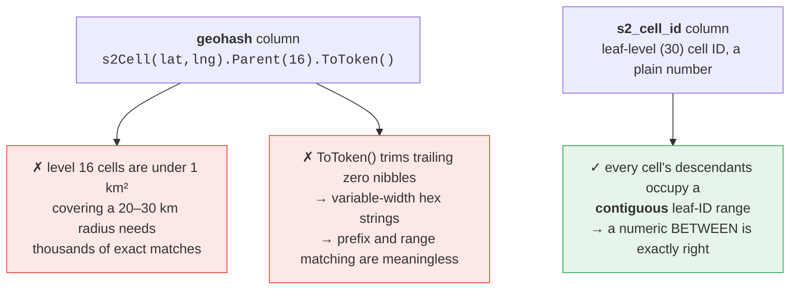
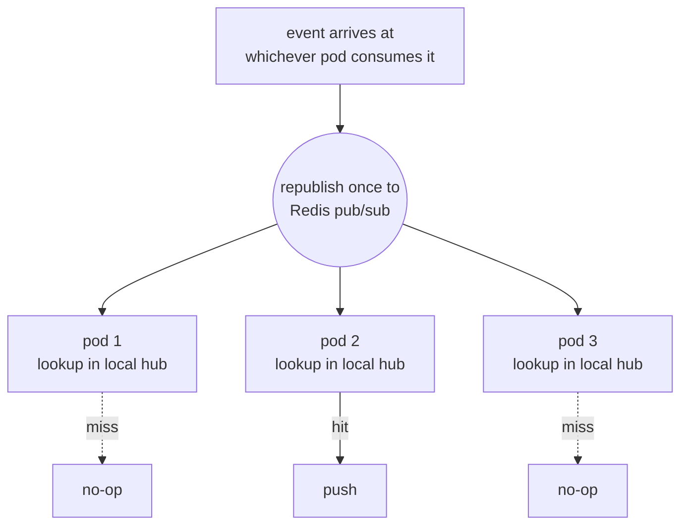
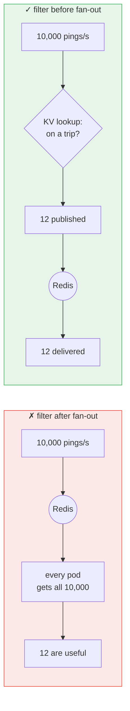
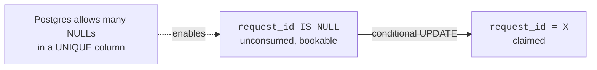
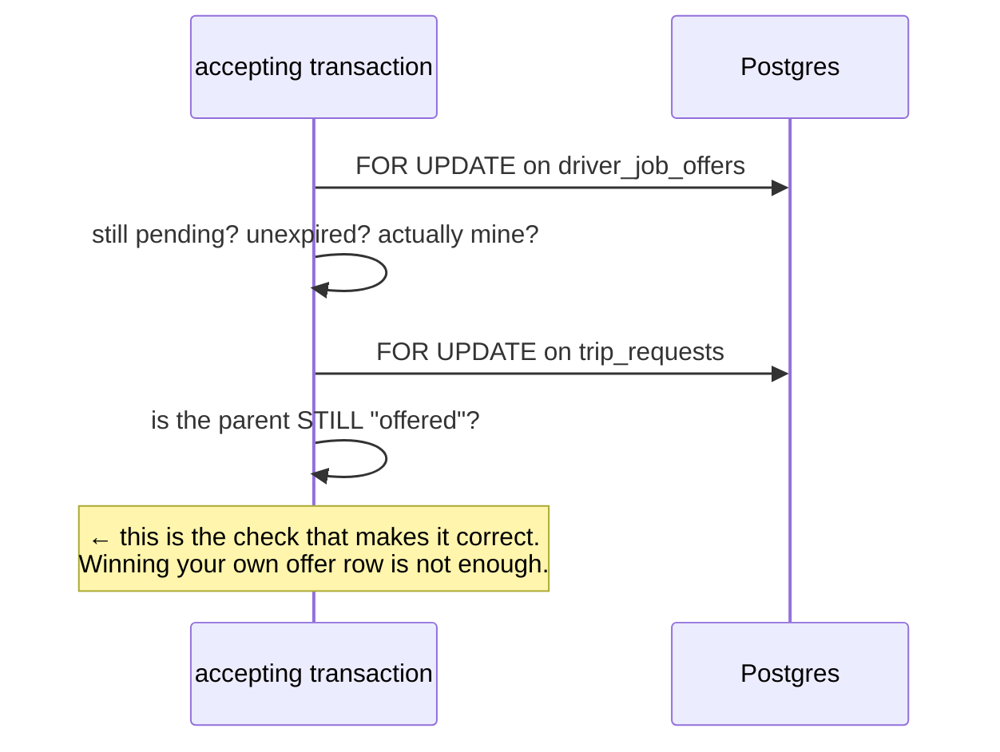
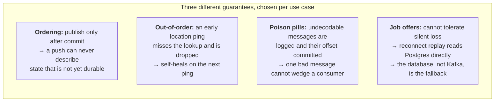
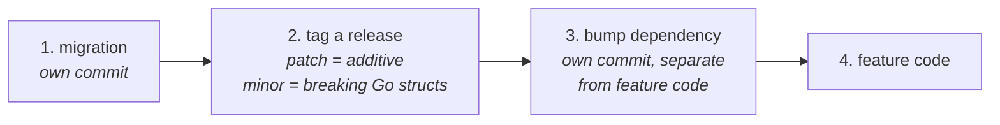
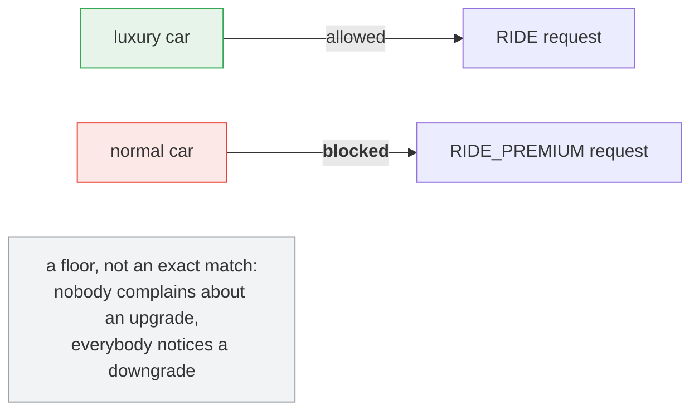
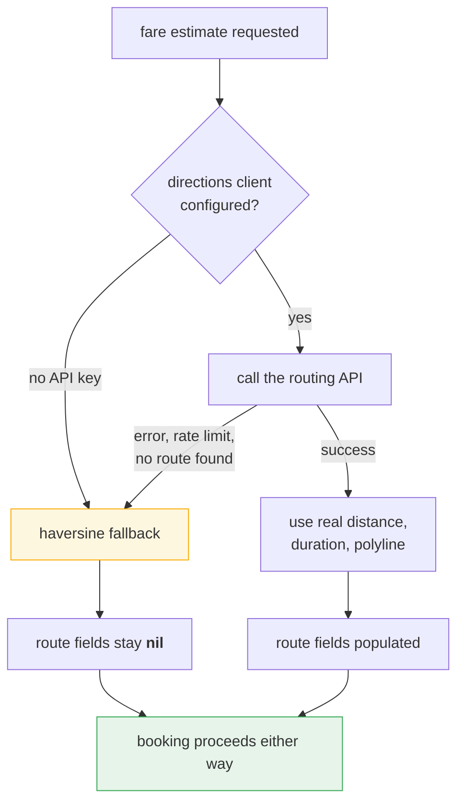
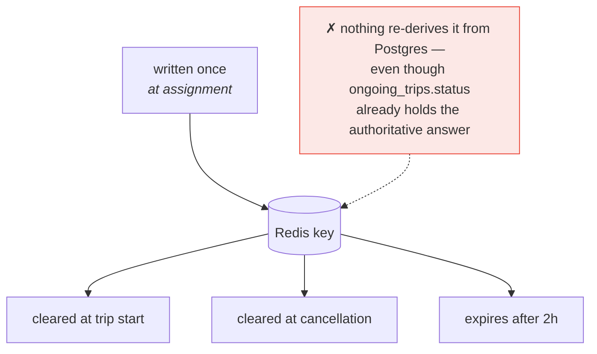

# Engineering Challenges

The genuinely hard problems in this platform, and how each was solved. This
is the document with the most engineering substance in it — each section is a
problem, the reasoning behind the fix, and what the fix cost.

Cancellation and redispatch have a dedicated write-up in
`cancellation-and-redispatch.md` and are only summarised here.

---

## Contents

| # | Challenge | Domain |
|---|---|---|
| 1 | Geospatial search with no PostGIS | Databases, algorithms |
| 2 | Pushing to a socket you cannot see | Distributed systems |
| 3 | Filtering a firehose before fan-out, not after | Scalability |
| 4 | Showing a price before committing to a search | Schema design |
| 5 | First-wins acceptance under real concurrency | Concurrency |
| 6 | Designing for at-least-once, out-of-order delivery | Distributed systems |
| 7 | Keeping N versioned services on one schema | Release engineering |
| 8 | Enforcing rules nobody noticed were unenforced | Correctness |
| 9 | Degrading gracefully when an external API fails | Resilience |
| 10 | Cancellation and redispatch | Summarised — see dedicated doc |
| 11 | A known gap with no recovery path | Honest accounting |

---

## 1. Geospatial nearest-driver search with no PostGIS

**The problem.** Finding the nearest available drivers is the core of
dispatch, and the schema has no PostGIS extension, no geography column, and no
spatial index — just plain latitude and longitude doubles.

The first working version did what that constraint suggests: a full Haversine
expression computed against *every fresh row* in `driver_locations`, on every
dispatch attempt, every retry, and every sweep tick. Correct, but a full table
scan that degrades linearly with fleet size.

**The tempting shortcut that was wrong.** `driver_locations` already stores a
`geohash` column, updated on every ping — the obvious thing to reach for.
Looking at how it is actually computed revealed two independent reasons it
cannot work:



Shipping a "spatial index" on the wrong column would have been a change that
looked like an optimisation, passed a quick smoke test, and then either did
nothing or returned wrong results at the edges.

**The actual mechanism.** The *other* stored column, `s2_cell_id`, is the
leaf-level S2 cell ID. Reading the S2 library's own source confirmed the trick
it is designed around: for any coarser cell at any level, `RangeMin()` and
`RangeMax()` bound the leaf IDs of every possible descendant. So a numeric
`BETWEEN` is a correct and efficient "is this point inside this cell" test, for
a covering computed at whatever level fits the radius —
`RegionCoverer{MaxCells: 8}` picks the level adaptively, so no manual
radius-to-level tuning is needed.

**The blocker that almost sank it.** `s2_cell_id` was `VARCHAR(32)`. A
`BETWEEN` on a string column is a **lexicographic** comparison, not numeric —
silently wrong for ranges, in the way that `"9" > "10"` is true for strings.
The fix needed a migration to `NUMERIC(20,0)`. Not `BIGINT`: unsigned 64-bit
cell IDs can exceed Postgres's signed maximum of 2⁶³−1.

Getting the *column type* right mattered more than the query logic around it.
The query would have "worked" against a string column too — just returned the
wrong candidate set some of the time, in a way that is very easy not to notice
in a small test.

**Result.** The covering pre-filters on an indexed range scan before any
trigonometry runs; the exact distance check still applies afterward, because a
covering is an over-approximation and must never be trusted as the final
answer. Verified as behaviour-neutral against the same seeded drivers —
proving it was *only* a performance change mattered as much as making it fast.

## 2. Delivering a push when you do not know which server holds the socket

**The problem.** `websocket-gateway` must run as multiple replicas, but a live
WebSocket is pinned to exactly one process's memory — a TCP connection cannot
be handed to another pod. Meanwhile every event that needs to reach a user is
produced by a *different* service, which has no idea which gateway instance
holds that connection. The Kafka consumer that picks the event up could itself
be on any instance.

**The fix: broadcast, then filter locally.**



The trade: some redundant lookups on idle pods, in exchange for zero shared
state, zero sticky sessions, and producers that know nothing about connection
topology.

Worth noting that this same shape now appears **eight** times in the gateway
(offers, withdrawals, assignments, location, start, end, complete, cancel).
Once the pattern was right once, every subsequent realtime feature was a copy
of the same three-file structure — `broadcast.go` / `notifier.go` /
`deliver.go` — rather than a new design problem. Repetition was chosen over
abstraction here deliberately: one pipeline's failure cannot affect another's.

## 3. Filtering a firehose before fan-out, not after

**The problem.** The broadcast-then-filter pattern is fine at the volume of
job offers or assignments — roughly one event per dispatch. Driver location
pings are a different volume class entirely: continuous, per-driver, whether
that driver is idle or mid-trip.

Naively reusing the same pattern would mean every gateway pod receiving a
Redis message for **every idle driver's every ping**, fleet-wide, forever. The
filtering would be happening at the wrong end of the pipe — work scaling with
fleet size to produce output scaling with active trips.



**The fix.** A Redis-backed key-value store — distinct from the pub/sub bus —
maps `driver_id → active trip`, populated only for drivers currently between
acceptance and pickup. One cheap lookup per ping; a miss is an immediate no-op
with no publish and deliberately **no log line** (logging at this volume would
itself become the problem).

The write and both clears hook onto events that were already being handled for
other reasons: written on assignment, cleared on trip-start (the rider is in
the car; pings add nothing) and on cancellation, with a two-hour TTL as the
backstop.

## 4. Letting a rider see a price before committing

**The problem.** The original design created a fare and a trip request
atomically in one call — simple, but a rider could never see a price and then
decide. Splitting it into "quote" then "book against that quote" sounds like a
small API change, but the schema had `trip_fares.request_id` as
`NOT NULL UNIQUE` with a foreign key *to* `trip_requests`. A fare could only
exist as a child of a request that already existed. The new flow needed
exactly the inverse.

**The fix that avoided a bigger migration.** Rather than restructuring the
relationship, just drop `NOT NULL`:



Postgres's `UNIQUE` already permits multiple `NULL`s, so `NULL` cleanly means
"unconsumed" and a value means "booked", with the foreign key and uniqueness
guarantees fully intact.

Booking becomes one conditional update inside the same transaction as the
insert:

```sql
UPDATE trip_fares SET request_id = ? WHERE fare_id = ? AND request_id IS NULL
```

checking `RowsAffected == 1`. **That single check is the entire first-booker-
wins race guard.** No explicit row lock is needed, because the conditional
update's own atomicity *is* the lock. It is simpler and cheaper than reasoning
about `SELECT ... FOR UPDATE` here, and it composes cleanly with the fare's
expiry check — also just a `WHERE` clause.

This decision paid off again later: when the quote flow expanded to return
**three** tiers at once, nothing about the claiming mechanism had to change.
Two of the three quotes simply never get claimed and expire.

## 5. First-wins acceptance under real concurrency

**The problem.** A dispatch attempt offers the same trip to up to ten drivers
simultaneously — by design. The accept endpoint must guarantee exactly one
succeeds, regardless of the order requests reach the database.

**The fix.** A two-step lock, with the crucial part being what is checked
under the *second* lock:



A driver can win the race on their own offer row and still lose, because
someone else's transaction already flipped the parent request to `assigned` a
moment earlier. That second check is what makes it correct, rather than merely
"locking something".

This child-then-parent, re-validate-at-each-step pattern became the template
every other locking flow was built to match — or to *deliberately* diverge
from. See `cancellation-and-redispatch.md` §3 for what happens when a new flow
needs the opposite order and why that must be handled carefully rather than
copied blindly.

## 6. Designing for at-least-once, out-of-order delivery

**The problem.** Eight independent topics feed eight independent consumers.
Kafka orders messages within a partition, never across topics, and a consumer
can reprocess a message after a crash-before-commit. Two very real
consequences: a location ping can be processed *before* the assignment event
for the same trip, and any consumer can see the same message twice.

**The decision — made explicitly, not discovered as a bug later.** Do not
engineer around either problem. Design so that they are harmless.



The last one is the important asymmetry. Seven pipelines are best-effort
because a missed push costs immediacy only. Job offers are different — a
driver must be able to act on one — so durability there comes from a
completely different mechanism: every WebSocket upgrade queries Postgres for
pending, unexpired offers and re-pushes them.

Three different consistency guarantees, chosen deliberately per use case,
rather than one blanket policy applied everywhere.

## 7. Keeping N independently-versioned services on one schema

**The problem.** `go-ride-db-schema` is consumed as a tagged Go module by six
`go.mod` files across two repos, each pinned to its own version. Every schema
change means: migrate, tag, then bump the dependency in every consumer that
needs it — and "needs it" is not always obvious. A service that never touches
a new column can still need the bump to pick up a struct field it reads
elsewhere, or a new shared constant.

**Where this actually bit.** Partway through cancellation work,
`driver-request-handler` and `trip-dispatch-worker` were found still pinned to
an older tag than `cab-request-handler`. The earlier rider-cancellation
feature had bumped only the one service that needed it *at the time*, and
nothing forced the others to catch up until they needed the same struct fields
months of feature-work later.

Not a bug — each service worked fine on its own pinned version — but exactly
the drift that stays invisible until two services must agree on a shared
contract and one is quietly behind.

**What keeps it manageable.** A convention enforced by habit rather than
tooling:



The convention does not prevent drift, but it makes drift trivially
*findable* — grepping every `go.mod` for the schema version is a one-line
audit — and fixable in isolation without tangling a dependency bump into an
unrelated diff.

The real lesson: in a polyrepo with versioned modules, the process discipline
around *how* a shared dependency is bumped matters as much as the schema
design itself.

## 8. Enforcing rules nobody had noticed were unenforced

Two bugs of the same species, found by auditing rather than by failure
reports. Both had been invisible because client behaviour happened to mask
them.

### The driver who was offline but still got offers

`drivers.is_online` existed, and dispatch **never consulted it.** A driver who
tapped "go offline" but whose app kept streaming location — or whose last ping
was still inside the five-minute freshness window — remained fully matchable.

Going offline appeared to work only because most driver apps *also* stop the
location stream and close the socket on that same tap. The backend never
enforced it at all. The availability check was entirely a client-side
convention that everyone assumed was a server-side rule.

Fix: join `drivers` and require `is_online = true AND is_paused = false`.

### The hatchback that could take a premium booking

Riders could pay for a premium tier and be matched with any car, because
dispatch had no notion of vehicle class. The fix introduces a deliberate
asymmetry:



**The shared lesson.** Both bugs were *absences* — a check that was never
written, not a check that was written wrong. Absences do not throw errors,
do not fail tests that were never written for them, and do not appear in logs.
They are found by asking "what does this query *not* filter on?" rather than
by debugging something that broke.

## 9. Degrading gracefully when an external API fails

**The problem.** Fare estimation was originally straight-line Haversine, which
systematically under-prices any city with a river, a one-way system, or a
motorway. Moving to a real driving route means introducing a **third-party
network dependency into the booking path** — the single most latency-sensitive
and availability-sensitive flow in the product.

**The fix.** Make the dependency strictly optional at every level:



The design detail worth noting: on the fallback path the `route_*` fields stay
**nil**, and that absence is the signal downstream consumers use. There is no
separate "was this a fallback?" flag to keep in sync. A nil polyline means
there is no route to draw; a nil duration means there is no real duration to
trust.

That propagates further than it first appears. The gateway derives a per-trip
average speed from `route_distance ÷ route_duration` to compute live ETAs — and
when those are nil, it falls back to a configured constant. One optional
upstream field degrades cleanly through three services without any of them
needing to know *why* it was absent.

## 10. Cancellation and redispatch

Full write-up: `cancellation-and-redispatch.md`.

Short version: adding driver-side cancellation required satisfying an existing
lock-order invariant from an awkward angle — the URL supplies only an
`ongoing_trip_id`, but the safe order demands locking `trip_requests` first —
and choosing per-stage semantics (auto-redispatch before pickup,
terminate-only mid-trip) that reused an existing event field rather than
needing new plumbing.

The most valuable part was what end-to-end testing surfaced rather than what
code review would have caught. Letting a request be dispatched a *second* time
broke two uniqueness constraints that had implicitly never been exercised
twice in the codebase's life, plus a "stuck forever, no recovery path" bug
that existed only because a synchronous retry had no sweep-based safety net.
None of the three were visible from reading the new code in isolation — they
lived at the intersection of new behaviour and old, unstated assumptions
elsewhere.

## 11. A known gap with no recovery path

**Not fixed. Recorded here honestly** rather than quietly omitted.

First, what is *not* a gap. The in-memory connection hub is completely wiped
when a gateway pod crashes — and that is fine. A live socket's TCP connection
dies with the process regardless of where it is tracked, the client reconnects
to whichever pod it lands on, and pending offers are replayed from Postgres on
every upgrade. First-connect and reconnect are handled identically by design.

The active-trip map is not lost on a pod crash either — it was deliberately
externalised to Redis for exactly that reason.

**The actual gap is one level down.** If *Redis itself* loses that key — a
restart without persistence, a failover, an outage — nothing rebuilds it.



The failure is silent by construction: a Redis miss is indistinguishable from
"this driver is not on a trip", so it produces no error and no log. Live
location pushes simply stop for affected trips until the trip starts anyway or
the TTL lapses.

Bounded, not catastrophic — polling still covers every other piece of trip
state, and this affects only the live location tick. But it is silent and
currently unrecoverable within that window.

**Shape of a fix, not built.** A periodic reconciliation sweep inside the
gateway, mirroring the ticker-loop shape the dispatch worker already uses. On
each tick, query `ongoing_trips WHERE status IN ('assigned','driver_arriving')`
— deliberately **not** the existing active-statuses helper, which also
includes `in_progress` and `awaiting_payment`, states where the entry was just
deliberately cleared and must stay cleared — and re-assert each row via the
same `SetActiveTrip` call assignment already makes.

Because that call is an unconditional `SET ... EX`, this is a plain idempotent
upsert-and-refresh: no delete or merge logic, and safe to run redundantly on
every pod with no leader election — the same "cheap redundant work over added
coordination" preference the rest of the fan-out design already leans on. It
would need wiring as a fire-and-forget goroutine, *not* folded into the
gateway's critical-path error fan-in: reconciliation is a best-effort
self-heal, not a delivery guarantee, and a transient database blip during one
tick must not be allowed to kill live connections.

---

## The recurring theme

Nearly every section above has the same shape. Something that looked like the
obvious tool for the job — a stored geohash column, copying an existing
fan-out pattern, a straightforward `INSERT` — turned out to be wrong once
checked against how it was *actually* built, or against an assumption baked in
elsewhere that a new feature was the first thing ever to violate.

The individual fixes were almost always small. Finding out **which assumption
was about to break** was the actual work.

A secondary theme runs through sections 4, 7, and 10: the best fixes reused
something the system was already doing for an unrelated reason. A nullable
column instead of a new relationship. An audit-log row instead of an exclusion
table. An existing event field instead of a new one. In a system with this
many moving parts, the cheapest mechanism is usually one that already exists.
