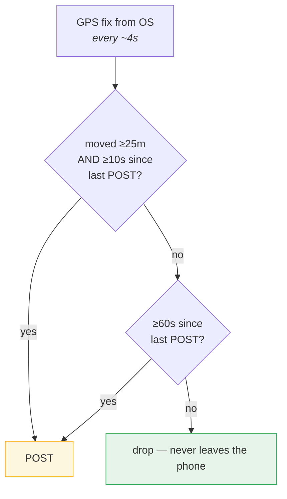
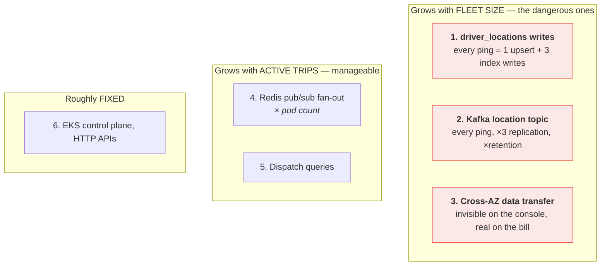
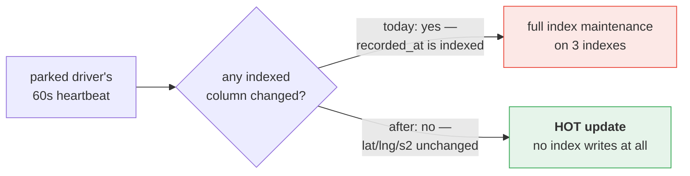
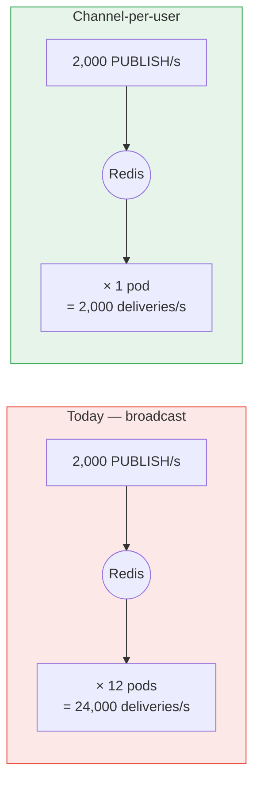
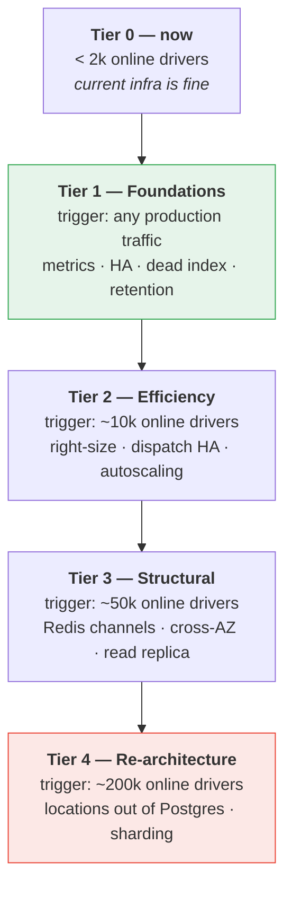

# Scaling and Cost

A staged plan for growing go-ride without the AWS bill growing faster than the
business. Nothing here is implemented yet — this is the roadmap, with the
reasoning and the numbers that justify each step.

The guiding principle:

> **Scale by removing work, not by buying bigger instances.**
> Every optimisation below is ranked by dollars saved per hour of engineering,
> and the cheapest wins turn out to be deletions, not additions.

---

## 1. How to read this document

| Section | Use |
|---|---|
| §2 Baseline | What is provisioned today and what it costs |
| §3 Workload model | The measured numbers everything else is derived from |
| §4 Cost drivers | Where money actually goes, ranked |
| §5 Optimisations | Each fix: problem, saving, effort, risk |
| §6 The ladder | Staged tiers with the metric that triggers each |
| §7 Projections | Estimated monthly cost at three scales |
| §8 Anti-patterns | What not to do, and why |

**A warning about every number below.** AWS pricing figures are approximate
us-east-1 on-demand rates and change over time. Treat them as
order-of-magnitude for prioritisation, and re-check the calculator before
committing budget. The *ratios* between options are more durable than the
absolute values.

## 2. Today's baseline

Every environment currently runs the Terraform module defaults — neither
`staging` nor `production` overrides them:

| Component | Provisioned | Approx. $/month |
|---|---|---|
| RDS Postgres | `db.t4g.micro`, 20 GB, **single-AZ** | ~$12 |
| MSK Kafka | 3 × `kafka.t3.small`, 100 GB/broker | ~$100 + storage |
| ElastiCache Redis | 1 × `cache.t4g.micro`, **no replica** | ~$12 |
| EKS control plane | one cluster, shared staging/production | ~$73 |
| EKS nodes | varies | — |
| **Per environment** | | **~$200–250** |

Three observations that matter more than the total:

1. **Nothing is sized for production.** `t4g.micro` everywhere is a
   development default that was never revisited.
2. **No high availability anywhere.** RDS `multi_az = false`, Redis
   `replica_count = 0` (which also leaves `automatic_failover_enabled` off).
3. **No metrics exist.** No Prometheus, OpenTelemetry, or StatsD dependency in
   any service. This is the blocker for everything else — see §5.0.

## 3. The workload model

All projections derive from one number: **how often a driver's phone posts a
location**. The driver app already throttles this intelligently
(`location-broadcaster.ts`), which changes the maths dramatically compared to a
naive fixed-interval design:

| Driver state | POST rate |
|---|---|
| Moving | ≤ 6/min (0.1/s) |
| Parked / idle | 1/min (0.017/s) |

Assuming a 30/70 moving-to-idle split, the blended rate is **~2.5 POSTs per
online driver per minute (0.042/s)**:

| Online drivers | Pings/s | Postgres upserts/s | Redis GETs/s |
|---|---|---|---|
| 1,000 | ~42 | ~42 | ~42 |
| 10,000 | ~420 | ~420 | ~420 |
| 50,000 | ~2,100 | ~2,100 | ~2,100 |
| 200,000 | ~8,300 | ~8,300 | ~8,300 |

**This client-side tiering is already the single largest cost optimisation in
the platform.** A naive 4-second ping would produce 50,000 writes/s at 200k
drivers instead of 8,300 — a 6× difference in the most expensive path in the
system. It is worth protecting: any future change that loosens the throttle
multiplies RDS, MSK and ElastiCache cost simultaneously.

## 4. Where the money actually goes

Ranked by how fast each grows with scale:

The top three all scale with **drivers online**, not with revenue. A driver
sitting parked and earning nothing still costs you writes, Kafka throughput and
transfer. That is the structural risk: **cost grows with supply, revenue grows
with completed trips.** Everything in §5 targets that gap.

## 5. The optimisations

### 5.0 Prerequisite — instrument before optimising

**No service currently exports a single metric.** Every number in this document
is derived from reading code, not from observation. Before spending money on
bigger instances *or* engineering time on the fixes below, you need to know
which of them actually matters in your deployment.

Minimum viable set:

| Metric | Answers |
|---|---|
| Pings/s at `location-producers` | Is the workload model right? |
| `driver_locations` upsert latency + RDS WAL bytes/s | Is §5.1 urgent? |
| Redis `instantaneous_ops_per_sec`, `pubsub_channels` | Is §5.3 urgent? |
| Gateway: broadcasts received vs. pushes delivered | The exact no-op ratio |
| Dispatch attempt duration, offers created per attempt | Is §5.4 urgent? |
| Per-AZ network bytes | Is §5.5 urgent? |

**Effort:** 2–3 days. **Saving:** none directly — but it prevents spending
weeks on the wrong optimisation. Do this first.

---

### 5.1 Delete the dead index on `driver_locations` ⭐ best return in the document

**The problem.** `driver_locations` has three indexes, all maintained on
*every* upsert:

| Index | Written per ping | Read by |
|---|---|---|
| `idx_driver_locations_s2_cell_id` | yes | the dispatch query ✅ |
| `idx_driver_locations_recorded_at` | yes | filter only, after the S2 range scan |
| `idx_driver_locations_geohash` | yes | **nothing — verified, zero query references** |

The `geohash` column is computed, stored and indexed on every single ping, and
is not referenced in a `WHERE` clause anywhere in the codebase. The S2 work
replaced it and the index was never dropped.

**The fix.** `DROP INDEX idx_driver_locations_geohash;` — one migration.

**The second-order win.** Consider also dropping
`idx_driver_locations_recorded_at`. The dispatch query already narrows via the
S2 range scan first, so `recorded_at >= ?` can be applied as a filter rather
than an index seek. That unlocks something valuable:

A stationary driver's heartbeat changes only `recorded_at` and `updated_at`.
With neither indexed, Postgres can perform a **Heap-Only Tuple update** — no
index maintenance whatsoever. That is roughly **70% of all ping traffic**
becoming dramatically cheaper.

**Saving:** ~30% fewer index writes immediately; up to ~70% of pings becoming
HOT-eligible. Directly defers the next RDS instance upgrade.
**Effort:** hours. **Risk:** low — but run `EXPLAIN ANALYZE` on the
nearest-driver query before and after, and confirm the planner still chooses
the S2 index. Add `fillfactor = 70` on the table so HOT updates have in-page
room.

---

### 5.2 Tune the Kafka location topic separately

**The problem.** All topics presumably share default retention. The location
topic carries ~8,300 msg/s at 200k drivers, replicated 3×. At ~300 bytes:

| Retention | Storage | ~$/month at $0.10/GB |
|---|---|---|
| 7 days | ~4.5 TB | ~$450 |
| 24 hours | ~650 GB | ~$65 |
| 3 hours | ~80 GB | ~$8 |

**The fix.** Location pings are strictly ephemeral — the freshness window is
300 seconds, so a ping older than five minutes is useless to every consumer.
Set `retention.ms` to a few hours on that topic alone (enough to survive a
consumer outage), leave trip-event topics at their longer retention.

Consider `compression.type=lz4` on the producer too; location payloads are
repetitive JSON and compress well.

**Saving:** hundreds of dollars/month at scale. **Effort:** one config change.
**Risk:** very low.

---

### 5.3 Redis: channel-per-user instead of broadcast

**The problem.** Every gateway pod receives every Redis message and must
`json.Unmarshal` it *before* discovering it holds no relevant connection
(`offers/deliver.go`). Delivery volume is `publishes × pod count`.

**The fix.** Let Redis's own subscription registry be the routing table:
`SUBSCRIBE user:{id}` on connect, `UNSUBSCRIBE` on disconnect, publisher does
`PUBLISH user:{id}` with no lookup.

Critically, this avoids a separate routing table (`user_id → pod`) which would
introduce a *new correctness risk*: a stale entry means silently lost messages,
whereas broadcast cannot route wrongly by construction. With subscriptions, a
dying pod drops its Redis connection and its subscriptions vanish
automatically — no TTL, no heartbeat, no reconciliation.

**Memory cost is negligible** — roughly 176 bytes per channel:

| Concurrent riders | Channel memory |
|---|---|
| 50,000 | ~9 MB |
| 200,000 | ~35 MB |

**The saving is mostly cross-AZ transfer, not node hours.** At 24,000
deliveries/s of ~400-byte payloads that is ~62 TB/month cross-AZ (~$620);
directed delivery cuts it to ~5 TB (~$52).

**Do this for the location channel only, at first.** Trip events (offers,
assignments, start/end/complete/cancel) run at ~5–8 messages per *trip* — a
thousand times lower volume. Broadcast's simplicity is worth more there.

**One caveat that makes this necessary rather than merely cheaper:** classic
Redis pub/sub in cluster mode propagates every message to every shard, so
scaling Redis horizontally does nothing for broadcast. You would be forced onto
sharded pub/sub (`SSUBSCRIBE`) regardless. Your `engine_version = "7.1"`
already supports it.

**Saving:** ~$500+/month at large scale, and it unblocks Redis scale-out.
**Effort:** ~1 week. **Risk:** medium — changes the delivery path.

---

### 5.4 Unpin `trip-dispatch-worker` from one replica

**The problem.** `replicaCount: 1`, pinned in every environment. The Kafka
consumer half would scale fine (consumer groups give each partition to one
member), but the sweep loop scans for due requests with no coordinating lock,
so two replicas would duplicate work.

This is a **hard availability ceiling**, not just a throughput one: matching
stops entirely while that single pod restarts.

**The fix, cheapest first:**

| Option | Mechanism | Effort |
|---|---|---|
| **Postgres advisory lock** | Only the lock holder runs the sweep; others run consumers only. Leader election for free, no new infrastructure. | ~2 days |
| Shard the sweep | Each replica claims `hash(request_id) % N == replica_index` | ~1 week |
| `SELECT ... FOR UPDATE SKIP LOCKED` | Replicas pull disjoint batches naturally | ~3 days |

The advisory lock is the right first move — it uses a database you already
have, needs no coordination service, and releases automatically when the
holding session dies.

**Saving:** not cost, **availability**. But it also lets you run two smaller
pods instead of one large one.
**Effort:** ~2 days. **Risk:** low.

---

### 5.5 Attack cross-AZ transfer directly

**The problem.** Cross-AZ traffic is charged in both directions, does not
appear as a line item you can easily attribute, and is generated by *every*
hop: EKS pod → RDS, pod → Redis, pod → MSK broker, and Kafka's own inter-broker
replication.

MSK replication is the quiet one: with replication factor 3 across three AZs,
**every produced byte crosses an AZ boundary twice.** At 8,300 pings/s × 300
bytes that is ~2.5 MB/s in, ~5 MB/s replicated cross-AZ ≈ 13 TB/month ≈ $130,
for the location topic alone.

**The fixes:**

1. **Enable rack awareness / closest-replica fetching** so consumers read from
   a same-AZ replica instead of always the leader.
2. **Compress** location payloads (§5.2) — halves everything downstream.
3. **Consider single-AZ for non-critical paths.** Redis is already single-node;
   pinning gateway pods to its AZ via node affinity removes that hop entirely.
   Weigh against the availability cost.

**Saving:** $100–600/month at scale. **Effort:** ~3 days. **Risk:** low to
medium — AZ pinning trades availability for cost and must be a conscious
choice.

---

### 5.6 Later: move `driver_locations` out of Postgres

**The problem.** At the largest scale this table is a high-frequency
key-value store living in a relational database that must also serve
transactional trip data. Every ping costs MVCC row versioning, WAL, index
maintenance and autovacuum pressure — and it competes for the same buffer pool
as the dispatch queries.

**The fix.** Redis `GEOADD` / `GEOSEARCH` replaces both the table *and* the S2
covering query:

| | Postgres today | Redis GEO |
|---|---|---|
| Write | upsert + index maintenance + WAL | one `GEOADD` |
| Nearest-driver read | S2 covering + Haversine CTE | one `GEOSEARCH BYRADIUS` |
| Durability | full | volatile — acceptable, pings expire in 300s anyway |

The data is inherently ephemeral: anything older than the freshness window is
discarded by the query regardless, so losing it on a Redis restart costs at
most one ping cycle per driver.

**Do not do this early.** It removes a whole class of RDS load, but it
relocates dispatch's correctness onto a store with weaker durability, and the
eligibility filters (`is_online`, tier, active-trip exclusion) still need
Postgres — so dispatch becomes a two-store join. Only worth it once RDS write
load is demonstrably the binding constraint.

**Saving:** potentially an entire RDS instance class. **Effort:** 2–3 weeks.
**Risk:** high.

---

## 6. The scaling ladder

Each tier lists the metric that should trigger it. **Do not implement a tier
before its trigger fires.**

### Tier 1 — Foundations (do these regardless of scale)

| Task | Effort | Why now |
|---|---|---|
| Add metrics (§5.0) | 3 d | Everything else is guesswork without it |
| `replica_count = 1` on Redis | 1 h | ~$12/mo turns a silent outage into a failover |
| `multi_az = true` on RDS | 1 h | Currently a single point of total data loss |
| Drop the `geohash` index (§5.1) | 2 h | Free throughput |
| Location topic retention (§5.2) | 1 h | Free storage |
| Dispatch advisory lock (§5.4) | 2 d | Removes the availability ceiling |

**Added cost: ~$30–40/month. Added resilience: substantial.**

### Tier 2 — Efficiency (~10k online drivers, ~420 pings/s)

- Right-size off `t4g.micro`: RDS → `db.m7g.large`, Redis stays small, MSK →
  `kafka.m7g.large` if broker CPU justifies it.
- HPA on `websocket-gateway` (connection count) and the HTTP APIs (CPU).
- Drop `idx_driver_locations_recorded_at`, set `fillfactor`, verify HOT updates.
- Buy **Savings Plans / Reserved Instances** on the steady-state baseline —
  typically 30–40% off for a 1-year commitment, and by far the highest
  dollar-per-effort item in this document.

### Tier 3 — Structural (~50k online drivers, ~2,100 pings/s)

- Redis channel-per-user for the location channel (§5.3).
- Cross-AZ reduction: rack awareness, compression, selective AZ pinning (§5.5).
- RDS read replica for the read-heavy endpoints (`/trips`, `/earnings`,
  `/stats`) — these are reporting queries with no consistency requirement.
- Consider a separate node group for `websocket-gateway`: it is
  memory-and-connection bound, unlike everything else, and mixing profiles
  wastes capacity.

### Tier 4 — Re-architecture (~200k online drivers, ~8,300 pings/s)

- `driver_locations` → Redis GEO (§5.6).
- Sharded pub/sub (`SSUBSCRIBE`) so Redis can scale horizontally.
- Shard dispatch by city or geography — natural boundary, since a request in
  one city never matches a driver in another.
- Partition `trip_history` by month; it is append-only and grows forever.

## 7. Cost projections

Rough monthly totals, same caveat as §1 — ratios matter more than absolutes.

| | Tier 1 (~1k drivers) | Tier 3 (~50k) | Tier 4 (~200k) |
|---|---|---|---|
| RDS | ~$25 (multi-AZ micro) | ~$350 (r7g.large multi-AZ) | ~$700 (r7g.xlarge) |
| MSK | ~$100 | ~$420 | ~$850 |
| ElastiCache | ~$25 | ~$120 | ~$240 |
| EKS + nodes | ~$150 | ~$600 | ~$2,000 |
| Cross-AZ transfer | ~$10 | ~$150 | ~$700 |
| **Unoptimised total** | **~$310** | **~$1,640** | **~$4,490** |
| **With §5 applied** | ~$310 | **~$1,150** | **~$2,600** |
| **+ Savings Plans** | ~$250 | **~$800** | **~$1,900** |

The compounding effect matters most at Tier 4: roughly **40% lower** than the
naive path, and the largest single contributors are the two cheapest fixes —
retention tuning and reserved capacity — not the expensive re-architecture.

## 8. Anti-patterns

Things that look like scaling and are not:

| Don't | Why |
|---|---|
| **Scale up before instrumenting** | You will buy the wrong resource. No metrics exist today. |
| **Loosen the client-side ping throttle** | It is the largest cost optimisation in the system (§3). Multiplies RDS + MSK + Redis + transfer simultaneously. |
| **Add Redis caching in front of Postgres reads** | Reads are not the bottleneck; writes are. This adds an invalidation problem for no gain. |
| **Move to Redis Cluster for pub/sub without `SSUBSCRIBE`** | Classic pub/sub broadcasts to every shard. You pay for nodes and get zero fan-out relief. |
| **Add a routing table `user_id → pod`** | Converts a design that *cannot* misroute into one where a stale entry silently drops messages. Use subscriptions instead (§5.3). |
| **Raise `NEAREST_DRIVERS_LIMIT` to fill trips faster** | Linearly multiplies offer rows, Kafka payload size, pub/sub fan-out and withdrawal events — for a marginal acceptance-rate gain. |
| **Scale `trip-dispatch-worker` replicas without fixing the sweep** | Duplicated work and confusing no-op logs. Fix the coordination first (§5.4). |
| **Cache fare quotes** | They are written once and read once. There is nothing to cache. |

## 9. Open questions

Things this plan cannot answer without production data:

1. **What is the real moving/idle split?** The 30/70 assumption in §3 drives
   every projection. Measure it first.
2. **How many drivers are online but never complete a trip?** They are pure
   cost. If the ratio is bad, a supply-side incentive change may beat any
   infrastructure work here.
3. **Is peak-to-trough ratio large?** If daily peak is 5× the trough,
   autoscaling and Serverless variants (Aurora Serverless v2, ElastiCache
   Serverless, MSK Serverless) become more attractive than reserved capacity.
4. **Is traffic geographically concentrated?** If so, city-level sharding
   (Tier 4) arrives earlier and is easier than expected.

## 10. Summary

The cheapest interventions are at the top, and none of them is a
re-architecture:

1. **Instrument** — you cannot optimise what you cannot see.
2. **Delete the dead `geohash` index** — free throughput, hours of work.
3. **Cut location-topic retention** — hundreds of dollars, one config line.
4. **Buy reserved capacity** — 30–40% off, zero engineering.
5. **Add HA** (~$30/month) — before, not after, the first outage.

Only then does the structural work in §5.3 and §5.6 become worth its risk.
